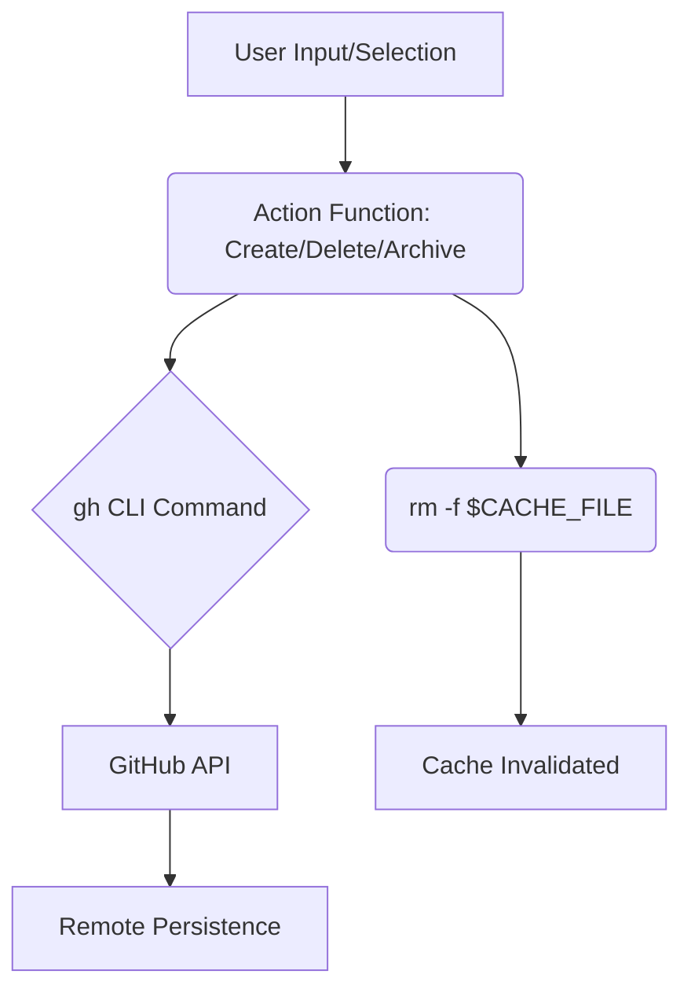
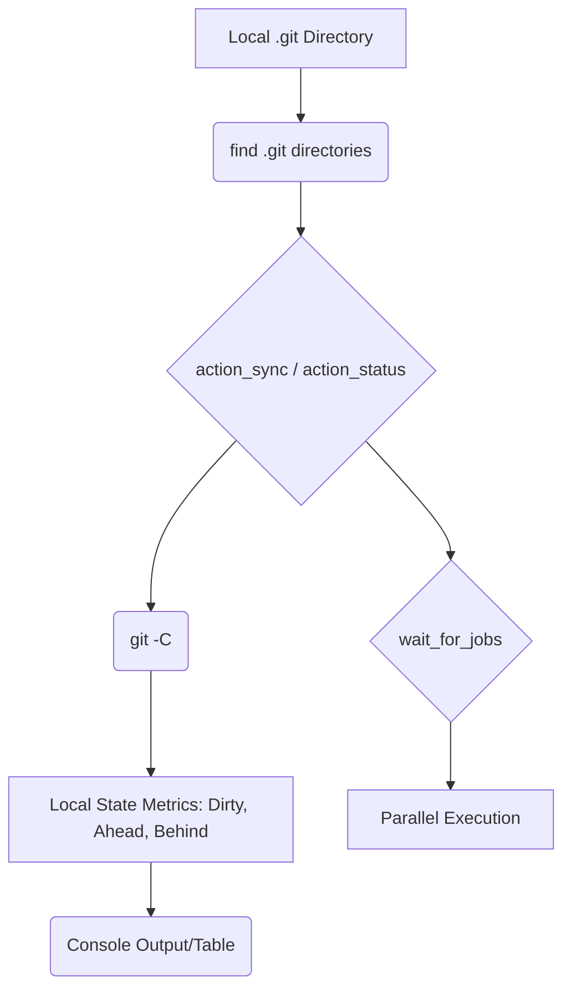

# Data Flow Analysis
The `ghtools` application is a Bash script that acts as a wrapper and interactive interface for the GitHub CLI (`gh`), `jq`, `fzf`, and `gum`. Its data flow is characterized by external API calls, file-based caching, and extensive use of `jq` for data transformation and filtering.

## Data Models Overview
The application primarily deals with two implicit data models: the GitHub Repository structure and the local Configuration settings.

### 1. GitHub Repository Data Model
This model is an implicit JSON structure defined by the fields requested from the GitHub API via the `gh repo list --json` command in `fetch_repositories_json`.

| Field Name | Data Type | Purpose | Used in Actions |
| :--- | :--- | :--- | :--- |
| `nameWithOwner` | String | Unique identifier (e.g., `user/repo`). | List, Clone, Delete, Search, Archive, Visibility |
| `description` | String | Repository summary. | List, Clone, Search, Fork |
| `visibility` | String | `PUBLIC` or `PRIVATE`. | List, Stats, Visibility |
| `primaryLanguage.name` | String | Main programming language. | List, Stats, Explore |
| `stargazerCount` | Integer | Number of stars. | Stats, Explore, Fork |
| `forkCount` | Integer | Number of forks. | Stats, Explore |
| `diskUsage` | Integer | Size in KB. | Stats |
| `updatedAt` | Timestamp | Last update time. | List, Stats, Explore |
| `isArchived` | Boolean | Archive status. | Stats, Archive |
| `url`, `sshUrl` | String | Clone/browse URLs. | Clone, Browse |

### 2. Configuration Data Model
Configuration is stored as key-value pairs in a plain text file, sourced directly into the shell environment.

| Variable | Default Value | Purpose |
| :--- | :--- | :--- |
| `CONFIG_DIR` | `$HOME/.config/ghtools` | Directory for config file. |
| `CONFIG_FILE` | `$CONFIG_DIR/config` | Path to the user configuration. |
| `CACHE_FILE` | `/tmp/ghtools_repos_$(id -u).json` | Path to the repository cache. |
| `CACHE_TTL` | 600 | Cache time-to-live in seconds. |
| `MAX_JOBS` | 5 | Max parallel jobs for `clone`/`sync`. |
| `DEFAULT_ORG` | "" | Default organization filter for listing. |
| `DEFAULT_CLONE_PATH` | "" | Default path for cloning repositories. |

## Data Transformation Map
Data transformation is a critical step, primarily using `jq` to process raw JSON from the GitHub API into formats suitable for shell processing, interactive selection, or console display.

| Input Format | Transformation Tool/Function | Output Format | Purpose |
| :--- | :--- | :--- | :--- |
| **Raw JSON** (from `gh`) | `fetch_repositories_json` | **Cached JSON** | Initial data retrieval and caching. |
| **Cached JSON** | `jq` filtering (`action_list`) | **Filtered JSON** | Applying filters like `--lang` or `--org`. |
| **Filtered JSON** | `jq -r '... | @tsv'` | **TSV String** | Serialization for shell processing. |
| **TSV String** | `while IFS=$'\t' read -r ...` loop | **Formatted Console Output** | Displaying lists with color, truncation (`truncate_text`), and date formatting (`date -d`). |
| **Cached JSON** | `jq` selection (`action_clone`, `action_search`) | **TSV String** (Name/Description) | Preparing data for interactive selection via `fzf`/`gum filter`. |
| **Cached JSON** | `jq` aggregation (`action_stats`) | **Aggregated Counts/Groups** | Calculating totals, grouping by language, and sorting by stars/updates. |
| **Local Git State** | `git -C <path> ...` commands | **Status Metrics** (Branch, Ahead, Behind, Dirty) | Transforming local repository state into displayable status indicators (`action_status`). |

## Storage Interactions
The application uses a file-based caching mechanism for performance and relies on the `gh` CLI for all external persistence.

### Caching (Cache-Aside Pattern)
*   **Location**: `$CACHE_FILE` (default: `/tmp/ghtools_repos_UID.json`).
*   **Mechanism**: `fetch_repositories_json` implements the cache logic:
    1.  It checks the file timestamp against `CACHE_TTL` using `is_cache_valid`.
    2.  If the cache is stale or a refresh is forced, it fetches data from GitHub and writes the JSON output to `$CACHE_FILE` using `umask 077` for secure permissions (600).
*   **Invalidation**: After any action that modifies the remote state (`action_delete`, `action_archive`, `action_visibility`), the script explicitly deletes the cache file (`rm -f "$CACHE_FILE"`) to ensure the next operation fetches fresh data.

### Configuration Persistence
*   **Location**: `$CONFIG_FILE` (default: `~/.config/ghtools/config`).
*   **Mechanism**: `load_config` sources the file, loading settings into the shell environment. `init_config` creates the file with default values if it does not exist.

### External Persistence
*   All data modifications (Create, Delete, Archive, Visibility, Fork) are persisted directly to the GitHub platform via the `gh` CLI commands. The script itself does not manage the persistence layer for repository data.

## Validation Mechanisms
The script includes several checks to ensure a stable and secure operating environment.

| Component | Validation Logic | Error Handling |
| :--- | :--- | :--- |
| **Dependencies** | `check_dependencies`: Verifies presence of `gh`, `fzf`, `git`, and `jq`. | Exits with a fatal error message listing missing tools. |
| **Authentication** | `check_gh_auth`: Runs `gh auth status`. | Exits with an error directing the user to run `gh auth login`. |
| **Permissions** | `check_delete_scope`: Checks for the `delete_repo` OAuth scope before deletion. | Prompts the user to run `gh auth refresh -s delete_repo`. |
| **Configuration** | `load_config`: Uses `grep` to check for unauthorized variable assignments in `$CONFIG_FILE` and checks file permissions. | Prints a warning and skips loading the config if security checks fail. |
| **Input Data** | `action_create`, `action_fork`: Checks if required user input (e.g., repository name, search query) is empty. | Prints an error and returns. |
| **Local Git State** | `action_sync`, `action_pr_create`: Checks for dirty working directories, detached HEAD state, and attempts to sync/PR from `main`/`master`. | Prints a warning and skips the operation or returns an error. |

## State Management Analysis
The application is primarily a thin, command-line interface, resulting in minimal internal state management.

*   **Stateless Operations**: Most commands (List, Search, Explore, Stats) are read-only and rely entirely on the GitHub API or the local cache, making them functionally stateless between executions.
*   **Ephemeral State**: User selections made via `fzf` or `gum` (e.g., selected repositories for cloning) are temporary and only exist within the scope of the current function execution.
*   **Parallelism State**: The `wait_for_jobs` function manages the concurrent state of background processes (`&`) during `clone` and `sync` operations, ensuring the number of active jobs does not exceed `$MAX_JOBS`.

## Serialization Processes
Serialization is the process of converting structured data (JSON) into a flat format for transport or display, while deserialization is the reverse.

*   **JSON Deserialization**: The `gh` CLI outputs JSON, which is immediately consumed by `jq`. `jq` acts as the primary deserializer, allowing the script to access and manipulate individual repository attributes.
*   **TSV Serialization**: For piping data to interactive tools like `fzf` or for processing in shell loops, `jq -r '... | @tsv'` serializes the JSON objects into tab-separated strings. This is a crucial DTO (Data Transfer Object) pattern within the shell environment.
*   **Display Serialization**: Functions like `print_table_row` and the formatting logic in `action_list` serialize data into a visually structured string, often incorporating ANSI color codes and text truncation, before printing to standard output.

## Data Lifecycle Diagrams

### 1. Repository Data Lifecycle (Read Path)

```mermaid
graph TD
    A[GitHub API] --> B(gh repo list --json);
    B --> C{fetch_repositories_json};
    C --> D{is_cache_valid?};
    D -- Yes --> E[Read $CACHE_FILE];
    D -- No/Refresh --> F[Write to $CACHE_FILE (umask 077)];
    F --> E;
    E --> G(jq Filtering/Aggregation);
    G --> H{fzf/gum Selection};
    G --> I(Console Output/Table);
    H --> J[Action Execution: Clone/Delete/Browse];
```

### 2. Repository Data Lifecycle (Write Path)



### 3. Local Repository Data Flow

