# ghtools Architecture

> Generated from knowledge graph analysis.  
> **Stats**: 43 files, 732 nodes, 2,181 edges, 15 clusters, 56 execution flows.

## Overview

`ghtools` is a Go CLI application that provides an interactive TUI for managing GitHub repositories. It wraps the official `gh` CLI and presents operations through a menu-driven bubbletea interface.

**Key design decisions**:
- **Shell-out to `gh`**: All GitHub API interaction delegates to the `gh` CLI via `exec.Command`. No direct GitHub API client.
- **Bubble Tea TUI**: All interactive components (menus, spinners, tables, inputs) use the bubbletea framework.
- **Cobra scaffolding**: Commands are declared with Cobra but the primary UX is the interactive menu, not flag-driven subcommands.
- **No tests**: The project currently has no test files.

## Functional Areas (Knowledge Graph Clusters)

The codebase organizes into 6 major functional communities:

| Area | Symbol Count | Role |
|------|-------------|------|
| **Cmd** | 16 | Cobra command handlers (`cmd/*.go`) — entry points for each feature. |
| **Tui** | 11 | Bubble Tea components (`internal/tui/`) — interactive UI models and helpers. |
| **Gh** | 10 | GitHub API wrapper (`internal/gh/`) — executes `gh` CLI commands and parses JSON. |
| **Git** | 9 | Local git operations (`internal/git/`) — status, branch, remote, dirty checks. |
| **Config** | 9 | Configuration management (`internal/config/`) — JSON config file handling. |
| **Template** | 4 | Template engine (`internal/template/`) — repository scaffolding templates. |

### Directory Structure

```
main.go              # Entry point → cmd.Execute()
cmd/
├── root.go          # Cobra root command, global flags, pre-flight checks
├── menu.go          # Interactive menu loop (the primary UX)
├── list.go          # List repositories with table output
├── search.go        # Search owned repositories
├── clone.go         # Clone multiple repos
├── create.go         # Create a new repository
├── fork.go           # Fork a repository
├── delete.go         # Delete repositories
├── archive.go        # Archive / unarchive
├── visibility.go     # Change repo visibility
├── browse.go         # Open repo in browser
├── trending.go       # Browse trending repos
├── explore.go        # Explore GitHub repos
├── stats.go          # Statistics dashboard
├── sync_cmd.go       # Sync local repos with remote
├── status.go         # Local repo status check
├── pr.go             # Pull request list
├── config_cmd.go     # Configuration editor
└── refresh.go        # Cache refresh

internal/
├── config/          # Config file (JSON) load/save/migration
├── gh/              # `gh` CLI wrapper — Run(), RunJSON(), CheckAuth(), repo operations
├── git/             # Local git commands — status, branch, dirty, ahead/behind
├── tui/             # Bubble Tea models — choose, confirm, input, multiselect, spinner, table, print styles
├── types/           # Shared type definitions
├── cache/           # Cache directory management
├── runner/          # Parallel execution helpers
└── template/        # Repository creation templates (Go, Node, Python)
```

## Key Execution Flows (Top 5)

### 1. `RunMenu` — Interactive Menu Loop
- **Entry**: `cmd/menu.go:runMenu`
- **Flow**: Renders a `chooseModel` with all app actions. On selection, dispatches to the corresponding `run*()` function. After each action, prompts the user to continue or exit.
- **Cross-cutting**: Calls `RunChooseWithTitle` (Tui) → dispatches to any Cmd → many paths end in `gh.Run()` (Gh) or Tui spinners/tables.
- **Steps** (from knowledge graph):
  1. `runMenu` → `RunChooseWithTitle` → `chooseModel` (selection UI)
  2. `runMenu` → `runList` → `FetchRepos` → `RunJSON` → `Run` (list branch)
  3. `runMenu` → `runSearch` → `RunMultiSelect` → `multiSelectModel` (search branch)
  4. `runMenu` → `runList` → `ShowEmptyState` / `ShowHeader` / `GetTerminalSize` (table rendering)

### 2. `RunList` — List Repositories
- **Entry**: `cmd/list.go:runList`
- **Flow**: Fetches all repos via `gh.FetchRepos`, then renders a styled table with `tui.PrintTable`.
- **Steps**:
  1. `runList` → `FetchRepos` (calls `gh api`)
  2. `FetchRepos` → `RunJSON` (unmarshal into structs)
  3. `RunJSON` → `Run` (execute `gh` subprocess)
  4. `runList` → `ShowHeader` → `GetTerminalSize` (dynamic table sizing)

### 3. `RunSearch` — Search Repositories
- **Entry**: `cmd/search.go:runSearch`
- **Flow**: Fetches repos, then presents a `multiSelectModel` so the user can pick multiple repos for bulk actions.
- **Steps**:
  1. `runSearch` → `FetchRepos` → `RunJSON` → `Run`
  2. `runSearch` → `RunMultiSelect` → `newMultiSelectModel` → `multiSelectModel`

### 4. `RunClone` — Clone Repositories
- **Entry**: `cmd/clone.go:runClone`
- **Flow**: Fetches repo list, presents multi-select, then runs `git clone` via a `spinnerModel` for progress feedback.
- **Steps**:
  1. `runClone` → `FetchRepos` → `RunJSON` → `Run`
  2. `runClone` → `RunWithSpinner` → `newSpinnerModel` → `spinnerModel`
  3. `RunWithSpinner` → `DoneMsg` (completion signal)

### 5. `RunStats` — Statistics Dashboard
- **Entry**: `cmd/stats.go:runStats`
- **Flow**: Fetches repos, computes stats (total, private/public counts, language distribution), and renders a styled summary with spinners and tables.
- **Steps**:
  1. `runStats` → `FetchRepos` → `RunJSON` → `Run`
  2. `runStats` → `RunWithSpinner` → `newSpinnerModel` → `spinnerModel`
  3. `runStats` → `ShowHeader` → `GetTerminalSize` (table formatting)

## Architecture Diagram (Mermaid)

```mermaid
graph TD
    %% Layers
    subgraph CLI["CLI Layer (cmd/)"]
        Root["root.go<br/>Execute()"]
        Menu["menu.go<br/>runMenu()"]
        List["list.go"]
        Search["search.go"]
        Clone["clone.go"]
        Create["create.go"]
        Fork["fork.go"]
        Delete["delete.go"]
        Archive["archive.go"]
        Visibility["visibility.go"]
        Browse["browse.go"]
        Trending["trending.go"]
        Explore["explore.go"]
        Stats["stats.go"]
        Sync["sync_cmd.go"]
        Status["status.go"]
        PR["pr.go"]
        ConfigCmd["config_cmd.go"]
        Refresh["refresh.go"]
    end

    subgraph TUI["TUI Layer (internal/tui/)"]
        Choose["choose.go<br/>RunChooseWithTitle"]
        Confirm["confirm.go<br/>RunConfirm"]
        Input["input.go<br/>RunInput"]
        MultiSelect["multiselect.go<br/>RunMultiSelect"]
        Spinner["spinner.go<br/>RunWithSpinner"]
        Table["table.go<br/>PrintTable / GetTerminalSize"]
        Print["print.go<br/>ShowHeader / ShowEmptyState"]
        Styles["styles.go<br/>lipgloss styles"]
    end

    subgraph GH["GitHub Layer (internal/gh/)"]
        GhRun["gh.go<br/>Run() / RunJSON()"]
        Repos["repos.go<br/>FetchRepos / CreateRepo / CloneRepo ..."]
        SearchAPI["search.go<br/>SearchRepos"]
        PRAPI["pr.go<br/>PRList / PRCreate"]
    end

    subgraph GIT["Git Layer (internal/git/)"]
        GitOps["git.go<br/>IsGitRepo / IsDirty / CurrentBranch / Pull / Push"]
    end

    subgraph CFG["Config Layer (internal/config/)"]
        ConfigOps["config.go<br/>Load / Init / DefaultConfig"]
    end

    subgraph SUP["Support (internal/)"]
        Cache["cache/"]
        Runner["runner/<br/>parallel.go"]
        Template["template/<br/>Apply"]
        Types["types/<br/>shared structs"]
    end

    subgraph EXT["External"]
        GhCLI["gh CLI<br/>(subprocess)"]
        GitCLI["git CLI<br/>(subprocess)"]
    end

    %% Main flow
    Root --> Menu
    Root -->|"direct subcommand"| List
    Root -->|"direct subcommand"| Search
    Root -->|"direct subcommand"| Clone
    Root -->|"direct subcommand"| Create
    Root -->|"direct subcommand"| Fork
    Root -->|"direct subcommand"| Delete
    Root -->|"direct subcommand"| Archive
    Root -->|"direct subcommand"| Visibility
    Root -->|"direct subcommand"| Browse
    Root -->|"direct subcommand"| Trending
    Root -->|"direct subcommand"| Explore
    Root -->|"direct subcommand"| Stats
    Root -->|"direct subcommand"| Sync
    Root -->|"direct subcommand"| Status
    Root -->|"direct subcommand"| PR
    Root -->|"direct subcommand"| ConfigCmd
    Root -->|"direct subcommand"| Refresh

    Menu -->|dispatch| List
    Menu -->|dispatch| Search
    Menu -->|dispatch| Clone
    Menu -->|dispatch| Create
    Menu -->|dispatch| Fork
    Menu -->|dispatch| Delete
    Menu -->|dispatch| Archive
    Menu -->|dispatch| Visibility
    Menu -->|dispatch| Browse
    Menu -->|dispatch| Trending
    Menu -->|dispatch| Explore
    Menu -->|dispatch| Stats
    Menu -->|dispatch| Sync
    Menu -->|dispatch| Status
    Menu -->|dispatch| PR
    Menu -->|dispatch| ConfigCmd
    Menu -->|dispatch| Refresh

    %% TUI interactions
    List --> Choose
    List --> Table
    List --> Print
    Search --> MultiSelect
    Search --> Table
    Clone --> MultiSelect
    Clone --> Spinner
    Create --> Input
    Create --> Confirm
    Delete --> MultiSelect
    Delete --> Confirm
    Archive --> Confirm
    Visibility --> Input
    Browse --> Choose
    Trending --> Table
    Explore --> Table
    Stats --> Spinner
    Stats --> Table
    Sync --> Choose
    Status --> Table
    PR --> Table
    ConfigCmd --> Input
    Refresh --> Spinner

    %% Data layer calls
    List --> Repos
    Search --> Repos
    Search --> SearchAPI
    Clone --> Repos
    Create --> Repos
    Fork --> Repos
    Delete --> Repos
    Archive --> Repos
    Visibility --> Repos
    Browse --> Repos
    Trending --> SearchAPI
    Explore --> SearchAPI
    Stats --> Repos
    Sync --> GitOps
    Status --> GitOps
    PR --> PRAPI
    ConfigCmd --> ConfigOps

    %% External delegation
    Repos -->|exec.Command| GhCLI
    SearchAPI -->|exec.Command| GhCLI
    PRAPI -->|exec.Command| GhCLI
    GhRun -->|exec.Command| GhCLI
    GitOps -->|exec.Command| GitCLI

    %% Support
    Repos --> Types
    SearchAPI --> Types
    PRAPI --> Types
    Create --> Template
    Sync --> Runner
    List --> Cache
    Stats --> Cache
    Trending --> Cache

    %% Config wiring
    Root -->|"PersistentPreRunE"| ConfigOps
    Root -->|"PersistentPreRunE"| GhRun
    Root -->|"PersistentPreRunE"| GitOps

    classDef cmd fill:#e1f5fe,stroke:#01579b,stroke-width:2px;
    classDef tui fill:#f3e5f5,stroke:#4a148c,stroke-width:2px;
    classDef gh fill:#e8f5e9,stroke:#1b5e20,stroke-width:2px;
    classDef git fill:#fff3e0,stroke:#e65100,stroke-width:2px;
    classDef cfg fill:#fce4ec,stroke:#880e4f,stroke-width:2px;
    classDef ext fill:#f5f5f5,stroke:#616161,stroke-width:2px;

    class Root,Menu,List,Search,Clone,Create,Fork,Delete,Archive,Visibility,Browse,Trending,Explore,Stats,Sync,Status,PR,ConfigCmd,Refresh cmd;
    class Choose,Confirm,Input,MultiSelect,Spinner,Table,Print,Styles tui;
    class GhRun,Repos,SearchAPI,PRAPI gh;
    class GitOps git;
    class ConfigOps cfg;
    class GhCLI,GitCLI ext;
```



## Cross-Community Call Patterns

| Caller → Callee | Pattern |
|----------------|---------|
| **Cmd → Tui** | Every command that needs user interaction calls a `Run*` helper (choose, confirm, input, multiselect, spinner). |
| **Cmd → Gh** | Data-fetching commands call `FetchRepos`, `SearchRepos`, or `PRList`, which internally call `RunJSON` → `Run`. |
| **Cmd → Git** | Local-sync commands (`sync`, `status`) call `IsGitRepo`, `IsDirty`, `Pull`, etc. |
| **Gh → External** | All `gh` and `git` package functions spawn subprocesses (`exec.Command`). There is no in-process HTTP client. |
| **Root → All** | `PersistentPreRunE` in `root.go` validates prerequisites: config migration, `gh` installed, `git` installed, `gh` authenticated. |

## Notable Observations from Knowledge Graph

1. **High fan-out from `menu.go`**: `runMenu` is the entry point for 56 traced execution flows. It is the central dispatcher of the application.
2. **`gh.Run()` is the bottleneck**: Almost every GitHub-related path converges on `internal/gh/gh.go:Run`, making it the single point of external dependency.
3. **TUI is heavily reused**: `RunWithSpinner`, `GetTerminalSize`, and `PrintTable` appear across 15+ flows. The Tui cluster is the most cross-connected functional area.
4. **Config is isolated**: The Config cluster is largely intra-community; only `root.go` and `config_cmd.go` interact with it.
5. **No Cache / Runner call graph depth**: Cache and Runner symbols exist but have low connectivity in the knowledge graph, indicating they are utility layers rather than core business logic.
