# PRD: ghtools Feature Expansion
## Repository Management Enhancement: List, Sync & Create

**Version:** 1.0
**Date:** 2025-11-03
**Status:** Planning - Ready for Implementation
**Author:** Planning PRP

---

## 1. Executive Summary

This PRD outlines the expansion of `ghtools` from a simple clone/delete utility to a comprehensive GitHub repository management CLI tool. The enhancement adds three critical features: repository listing/visualization (`list`), mass synchronization (`sync`), and interactive repository creation (`create`). These features complete the CRUD operations for repository management while maintaining the tool's focus on user experience, interactive workflows, and safety.

**Core Value Proposition:**
- **Current State:** ghtools handles clone and delete operations with excellent UX
- **Target State:** Complete repository lifecycle management with consistent, intuitive interface
- **Key Differentiator:** Interactive, safe, and visually appealing CLI experience using fzf

**Success Metrics:**
- Primary: User experience quality (interface intuitiveness, clear messaging, visual design)
- Secondary: Feature completeness, error handling robustness

---

## 2. Problem & Solution

### 2.1 Problem Statement

GitHub developers face several workflow inefficiencies:

1. **Repository Discovery Gap**: Users can clone/delete repos but lack visibility into their repository portfolio without visiting github.com
2. **Synchronization Overhead**: Managing multiple local repositories requires manual checking of each directory
3. **Creation Friction**: Creating new repositories involves multiple steps: web UI → manual configuration → clone → initial setup

**Current Workarounds:**
- Using `gh repo list` with limited formatting options
- Manual `cd` + `git status` + `git pull` loops across directories
- Web-based repository creation followed by manual cloning

### 2.2 Solution Overview

Extend ghtools with three integrated commands that maintain the existing design philosophy:

#### Feature 1: `ghtools list`
**Purpose:** Comprehensive repository visualization and filtering
**Solution:** Rich table display with advanced filtering, sorting, and export capabilities

#### Feature 2: `ghtools sync`
**Purpose:** Mass repository synchronization
**Solution:** Intelligent directory scanning with batch operations and conflict handling

#### Feature 3: `ghtools create`
**Purpose:** Streamlined repository creation
**Solution:** Interactive prompts with templates and automatic initialization

**Design Principles (Inherited from existing codebase):**
- Interactive-first with command-line fallbacks
- fzf integration for selections
- Colorful, clear output
- Comprehensive error handling
- Safety confirmations for destructive actions
- Modular, maintainable bash code

---

## 3. Market & Technical Research

### 3.1 Competitive Analysis

| Tool | List | Sync | Create | UX Quality | Notes |
|------|------|------|--------|------------|-------|
| gh CLI | ✓ Basic | ✗ | ✓ Basic | Functional | Limited formatting, no interactivity |
| ghtools (current) | ✗ | ✗ | ✗ | Excellent | Strong UX foundation |
| hub | ✓ | ✗ | ✓ | Good | Deprecated in favor of gh |
| lazygit | ✗ | ✓ Single | ✗ | Excellent | TUI, single-repo focus |
| Custom scripts | Varies | Varies | Varies | Poor | Fragmented solutions |

**Market Gap:** No tool combines comprehensive GitHub repository management with interactive CLI UX excellence.

### 3.2 Technical Research Findings

**gh CLI Capabilities:**
- `gh repo list`: Supports JSON output, basic filtering, pagination
- `gh api`: Direct REST API access for advanced queries
- `gh repo create`: Template support, visibility settings
- Rich flag system: `--json`, `--jq`, `--limit`, `--visibility`, etc.

**Best Practices from fzf Ecosystem:**
- Preview windows for contextual information
- Multi-select with visual feedback
- Keybinding customization (Ctrl+A, Ctrl+D)
- Color schemes for different action types
- Dynamic reload capabilities

**Bash Design Patterns:**
- Function-based architecture for testability
- Associative arrays for data structures
- `set -euo pipefail` for error handling
- Temporary variable scoping with `local`
- Error accumulation for batch operations

---

## 4. User Stories & Acceptance Criteria

### Epic 1: Repository Listing & Visualization

#### Story 1.1: Basic Repository Listing
**As a** GitHub developer
**I want** to view all my repositories with key information
**So that** I can quickly assess my repository portfolio

**Acceptance Criteria:**
- ✓ Display repository name, description, visibility, language
- ✓ Show stars, forks, watchers counts
- ✓ Display repository size and last update date
- ✓ Indicate archived status with visual marker
- ✓ Default to compact table format
- ✓ Handle repositories without descriptions gracefully
- ✓ Support pagination for users with 100+ repositories

**Technical Notes:**
- Use `gh repo list --json` with fields: name, description, visibility, primaryLanguage, stargazersCount, forkCount, watchers, diskUsage, updatedAt, isArchived
- Format using `column` or `printf` for aligned output
- Colorize: archived (gray), private (yellow), public (green)

#### Story 1.2: Repository Filtering
**As a** developer with many repositories
**I want** to filter repositories by language, visibility, or archived status
**So that** I can focus on relevant repositories

**Acceptance Criteria:**
- ✓ `--lang LANGUAGE` filters by primary language
- ✓ `--visibility [public|private]` filters by visibility
- ✓ `--archived` shows only archived repositories
- ✓ `--no-archived` excludes archived repositories (default)
- ✓ Multiple filters can be combined (AND logic)
- ✓ Case-insensitive language matching
- ✓ Clear message when no repositories match filters

**Technical Notes:**
- Filter locally after fetching (gh API doesn't support all filter combinations)
- Use `jq` for complex JSON filtering if available, fallback to awk/grep

#### Story 1.3: Repository Sorting
**As a** user analyzing my repositories
**I want** to sort by various attributes
**So that** I can identify top projects or recently active repositories

**Acceptance Criteria:**
- ✓ `--sort [stars|created|updated|name]` controls sort order
- ✓ Default sort: updated (most recent first)
- ✓ `--order [asc|desc]` controls sort direction
- ✓ Numeric sorting for counts (stars, forks)
- ✓ Date sorting for created/updated
- ✓ Alphabetical sorting for names

#### Story 1.4: Data Export
**As a** user documenting my work
**I want** to export repository information
**So that** I can use the data in reports or other tools

**Acceptance Criteria:**
- ✓ `--export json` outputs formatted JSON
- ✓ `--export csv` outputs CSV with headers
- ✓ Export respects filters and sorting
- ✓ CSV properly escapes special characters in descriptions
- ✓ JSON maintains all data types (numbers as numbers, not strings)
- ✓ Export to stdout (can be redirected by user)

**Example Output:**
```csv
Name,Description,Visibility,Language,Stars,Forks,Size (KB),Updated,Archived
owner/repo1,"A cool project",public,Python,42,7,1250,2025-11-01,false
```

---

### Epic 2: Mass Repository Synchronization

#### Story 2.1: Repository Discovery
**As a** developer with local clones
**I want** ghtools to find all git repositories in a directory tree
**So that** I can sync them without manual tracking

**Acceptance Criteria:**
- ✓ Scan current directory (or `--path DIR`) recursively
- ✓ Identify git repositories (directories with `.git`)
- ✓ Detect remote URL and match to GitHub
- ✓ Exclude non-GitHub repositories with clear indication
- ✓ Handle nested repositories (stop at first `.git` per branch)
- ✓ Display discovered repositories count before operations
- ✓ Max depth limit (e.g., 5 levels) with `--max-depth` flag

**Technical Notes:**
- Use `find . -name .git -type d` for discovery
- Extract remote with `git -C <dir> remote get-url origin`
- Parse GitHub URLs (https and SSH formats)

#### Story 2.2: Repository Status Check
**As a** developer
**I want** to see the sync status of each repository
**So that** I understand what needs updating

**Acceptance Criteria:**
- ✓ Display current branch name
- ✓ Show commits ahead/behind remote (e.g., "↑2 ↓3")
- ✓ Indicate uncommitted changes (staged, unstaged)
- ✓ Identify detached HEAD state
- ✓ Detect missing remote branch
- ✓ Flag repositories with conflicts
- ✓ Colorize status: synced (green), behind (yellow), ahead (blue), conflict (red)

**Technical Notes:**
```bash
git -C <dir> status --porcelain --branch
git -C <dir> rev-list --left-right --count origin/main...HEAD
```

#### Story 2.3: Batch Synchronization
**As a** developer
**I want** to sync multiple repositories at once
**So that** I can save time

**Acceptance Criteria:**
- ✓ Default: Interactive fzf selection (multi-select)
- ✓ `--all` flag: Sync all discovered repositories
- ✓ `--dry-run`: Show what would be done without executing
- ✓ Pull repositories that are behind remote
- ✓ Skip repositories with local uncommitted changes (with warning)
- ✓ **Skip repositories with conflicts** (user preference: "Avisar e pular")
- ✓ Display summary: synced, skipped, failed
- ✓ Parallel execution option `--parallel N` (advanced)

**Technical Notes:**
- Use `git -C <dir> pull --ff-only` for safe pulls
- Detect conflicts by checking exit code and output
- Implement sequential by default (easier debugging)

#### Story 2.4: Sync with Uncommitted Changes
**As a** developer in mid-work
**I want** sync to handle my uncommitted changes safely
**So that** I don't lose work

**Acceptance Criteria:**
- ✓ Detect uncommitted changes before pull
- ✓ Skip repository with clear warning message
- ✓ List affected files in warning
- ✓ Provide hint: "Commit or stash changes first"
- ✓ Continue to next repository
- ✓ Include in final summary (skipped count)

---

### Epic 3: Interactive Repository Creation

#### Story 3.1: Basic Repository Creation
**As a** developer starting a new project
**I want** to create a GitHub repository interactively
**So that** I can quickly set up version control

**Acceptance Criteria:**
- ✓ Prompt for repository name (validate: alphanumeric, hyphens, underscores)
- ✓ Prompt for description (optional, multiline not required for MVP)
- ✓ Choose visibility: public or private
- ✓ Option to add README.md
- ✓ Create repository via `gh repo create`
- ✓ Display repository URL on success
- ✓ **Ask if user wants to clone** (user preference: "Perguntar sempre")

**Technical Notes:**
```bash
gh repo create OWNER/NAME \
  --description "..." \
  --public/--private \
  --add-readme
```

#### Story 3.2: License Selection
**As a** developer creating an open-source project
**I want** to choose a license during creation
**So that** I properly license my code

**Acceptance Criteria:**
- ✓ Present common licenses: MIT, GPL-3.0, Apache-2.0, BSD-3-Clause, None
- ✓ Use fzf for license selection (single select)
- ✓ Default to "None" (skip)
- ✓ Add license file via `gh` if supported, else manual creation
- ✓ Display brief license description in preview window

**Technical Notes:**
- Check `gh repo create --help` for `--license` flag
- Fallback: Create LICENSE file after repo creation using gh API or template

#### Story 3.3: .gitignore Template
**As a** developer working in specific languages
**I want** to add appropriate .gitignore files
**So that** I don't commit unnecessary files

**Acceptance Criteria:**
- ✓ Prompt for language/framework (optional)
- ✓ Common templates: Python, Node, Go, Rust, Java, C++, Web (HTML/CSS/JS), None
- ✓ Use fzf for selection
- ✓ Add via gh CLI: `--gitignore TEMPLATE`
- ✓ Display preview of .gitignore contents (first 10 lines)

#### Story 3.4: Project Templates (Advanced)
**As a** developer starting typed projects
**I want** to use predefined templates
**So that** I can bootstrap projects quickly

**Acceptance Criteria:**
- ✓ Prompt: "Use template?" (Yes/No)
- ✓ Available templates: Python, Node.js, Go, Rust, Web
- ✓ Templates include:
  - Python: README, .gitignore, requirements.txt, main.py, pyproject.toml
  - Node: README, .gitignore, package.json, index.js
  - Go: README, .gitignore, go.mod, main.go
  - Rust: README, .gitignore, Cargo.toml (use `cargo init` if available)
  - Web: README, index.html, style.css, script.js
- ✓ Create files after repository creation
- ✓ Make initial commit with template files

**Technical Notes:**
- Store templates as heredocs in functions
- Use `gh api` to create files or clone + commit + push

#### Story 3.5: Branch Configuration
**As a** developer following modern Git practices
**I want** to set the default branch name
**So that** I use 'main' instead of 'master'

**Acceptance Criteria:**
- ✓ Default branch: `main` (gh CLI default)
- ✓ Allow `--default-branch NAME` flag for customization
- ✓ Ensure initial commit uses specified branch
- ✓ Set default branch via gh API if creating via template

---

## 5. Technical Architecture

### 5.1 System Architecture

```mermaid
graph TB
    subgraph "ghtools CLI"
        Main[main function]
        Menu[Interactive Menu]

        subgraph "Existing Features"
            Clone[action_clone]
            Delete[action_delete]
        end

        subgraph "New Features"
            List[action_list]
            Sync[action_sync]
            Create[action_create]
        end

        subgraph "Shared Utilities"
            Auth[check_gh_auth]
            Deps[check_dependencies]
            Fetch[fetch_repositories]
            Print[print_* functions]
            FzfUtil[fzf_wrapper]
        end
    end

    subgraph "External Dependencies"
        GH[gh CLI]
        FZF[fzf]
        Git[git]
        JQ[jq (optional)]
    end

    subgraph "GitHub Services"
        API[GitHub REST API]
        Repos[(Repository Data)]
    end

    Main --> Menu
    Menu --> Clone
    Menu --> Delete
    Menu --> List
    Menu --> Sync
    Menu --> Create

    List --> Auth
    List --> Fetch
    List --> Print

    Sync --> Auth
    Sync --> Deps
    Sync --> FzfUtil
    Sync --> Git

    Create --> Auth
    Create --> FzfUtil
    Create --> Print
    Create --> GH

    Clone --> GH
    Delete --> GH
    List --> GH
    Sync --> Git
    Create --> GH

    GH --> API
    API --> Repos

    style List fill:#a8d5ff
    style Sync fill:#a8d5ff
    style Create fill:#a8d5ff
```

### 5.2 Data Flow Diagrams

#### 5.2.1 List Command Flow


#### 5.2.2 Sync Command Flow

```mermaid
sequenceDiagram
    actor User
    participant ghtools
    participant FileSystem
    participant git
    participant fzf
    participant GitHub Remote

    User->>ghtools: ghtools sync --path ~/projects
    ghtools->>FileSystem: find . -name .git -type d
    FileSystem-->>ghtools: List of .git directories

    loop For each repository
        ghtools->>git: git remote get-url origin
        git-->>ghtools: Remote URL
        ghtools->>git: git status --porcelain --branch
        git-->>ghtools: Status info
        ghtools->>git: git rev-list --count origin/main...HEAD
        git-->>ghtools: Ahead/behind counts
    end

    ghtools->>ghtools: Build status summary
    ghtools->>fzf: Display repos with status (multi-select)
    User->>fzf: Select repositories to sync
    fzf-->>ghtools: Selected repository paths

    loop For each selected repository
        alt No local changes
            ghtools->>git: git pull --ff-only
            git->>GitHub Remote: Fetch & merge
            GitHub Remote-->>git: Updated refs
            git-->>ghtools: Success
            ghtools-->>User: ✓ Synced: repo-name
        else Has local changes
            ghtools-->>User: ⚠ Skipped: repo-name (uncommitted changes)
        else Has conflicts
            ghtools-->>User: ⚠ Skipped: repo-name (conflicts detected)
        end
    end

    ghtools-->>User: Summary: 5 synced, 2 skipped, 0 failed
```



#### 5.2.3 Create Command Flow


### 5.3 Data Models

#### 5.3.1 Repository Data Structure

```bash
# Fetched from gh repo list --json
declare -A repository=(
    [name]="owner/repo-name"
    [nameWithOwner]="owner/repo-name"
    [description]="Repository description"
    [visibility]="PUBLIC|PRIVATE"
    [primaryLanguage]="Python"
    [stargazersCount]=42
    [forkCount]=7
    [watchers]=15
    [diskUsage]=1250          # KB
    [updatedAt]="2025-11-01T12:00:00Z"
    [createdAt]="2024-01-15T08:30:00Z"
    [isArchived]="false"
    [url]="https://github.com/owner/repo-name"
    [sshUrl]="git@github.com:owner/repo-name.git"
)
```

#### 5.3.2 Sync Status Structure

```bash
# Per-repository sync status
declare -A sync_status=(
    [path]="/home/user/projects/repo-name"
    [name]="repo-name"
    [remote_url]="git@github.com:owner/repo-name.git"
    [current_branch]="main"
    [ahead]=2                 # Commits ahead of remote
    [behind]=3                # Commits behind remote
    [uncommitted_changes]=1   # Boolean: has unstaged/staged changes
    [has_conflicts]=0         # Boolean: has merge conflicts
    [detached_head]=0         # Boolean: in detached HEAD state
    [status]="BEHIND|AHEAD|SYNCED|CONFLICT|DIRTY"
    [color]="yellow"          # Visual indicator color
)
```

#### 5.3.3 Create Configuration Structure

```bash
# Repository creation configuration
declare -A create_config=(
    [name]="my-new-repo"
    [description]="Optional description"
    [visibility]="public"     # public|private
    [add_readme]="true"
    [license]="MIT"           # MIT|GPL-3.0|Apache-2.0|BSD-3-Clause|none
    [gitignore]="Python"      # Language template or none
    [template]="python"       # python|node|go|rust|web|none
    [default_branch]="main"
    [should_clone]="true"     # User choice
)
```

### 5.4 API Specifications

#### 5.4.1 Command-Line Interface

```bash
# List Command
ghtools list [OPTIONS]

OPTIONS:
  --lang LANGUAGE         Filter by primary language (e.g., Python, JavaScript)
  --visibility VISIBILITY Filter by visibility: public, private, or all (default: all)
  --archived              Show only archived repositories
  --no-archived           Exclude archived repositories (default)
  --sort FIELD            Sort by: stars, created, updated, name (default: updated)
  --order ORDER           Sort order: asc or desc (default: desc for counts/dates, asc for name)
  --export FORMAT         Export as: json or csv (default: table output)
  --limit N               Maximum repositories to fetch (default: 1000)

EXAMPLES:
  ghtools list
  ghtools list --lang python --sort stars
  ghtools list --visibility private --no-archived
  ghtools list --export csv > repos.csv
  ghtools list --sort updated --order asc

# Sync Command
ghtools sync [OPTIONS]

OPTIONS:
  --path PATH             Directory to scan for repositories (default: current directory)
  --max-depth N           Maximum directory depth to scan (default: 5)
  --all                   Sync all discovered repositories without interactive selection
  --dry-run               Show what would be done without executing
  --parallel N            Execute N sync operations in parallel (advanced, default: 1)

EXAMPLES:
  ghtools sync
  ghtools sync --path ~/projects
  ghtools sync --dry-run
  ghtools sync --all --path ~/work

# Create Command
ghtools create [NAME] [OPTIONS]

ARGUMENTS:
  NAME                    Repository name (if omitted, will prompt)

OPTIONS:
  --description TEXT      Repository description
  --public                Create public repository (default)
  --private               Create private repository
  --readme                Add README.md (default: prompt)
  --no-readme             Skip README.md
  --license LICENSE       License: MIT, GPL-3.0, Apache-2.0, BSD-3-Clause, none
  --gitignore TEMPLATE    .gitignore template: Python, Node, Go, Rust, Java, Web, none
  --template TYPE         Project template: python, node, go, rust, web, none
  --default-branch NAME   Default branch name (default: main)
  --clone                 Clone repository after creation (default: prompt)
  --no-clone              Don't clone repository after creation

EXAMPLES:
  ghtools create                                    # Interactive mode
  ghtools create my-project --public --readme       # Quick creation
  ghtools create my-api --template node --clone     # With template
  ghtools create test-repo --private --no-readme    # Minimal private repo
```

#### 5.4.2 GitHub CLI API Calls

```bash
# List: Fetch repositories
gh repo list --limit 1000 --json name,description,visibility,primaryLanguage,stargazersCount,forkCount,watchers,diskUsage,updatedAt,createdAt,isArchived,url,sshUrl

# Create: Basic repository
gh repo create OWNER/NAME \
  --description "Description" \
  --public|--private \
  --add-readme|--no-readme \
  --license MIT \
  --gitignore Python

# Create: Clone repository
gh repo clone OWNER/NAME [DIRECTORY]

# Utility: Check authentication
gh auth status

# Utility: API direct access (for advanced operations)
gh api /user/repos \
  --method POST \
  --field name=REPO_NAME \
  --field description="..." \
  --field private=false
```

### 5.5 Code Structure

```bash
# File: ghtools
# New functions to add:

# ============================================================================
# List Command Functions
# ============================================================================

# Main list action
action_list() {
    # Parse arguments, fetch repos, filter, sort, format output
}

# Fetch repositories with full metadata
fetch_repositories_full() {
    gh repo list --limit "$limit" --json "$fields"
}

# Filter repositories by criteria
filter_repositories() {
    # Input: JSON array of repos, filter criteria
    # Output: Filtered JSON array
    # Use jq if available, fallback to awk/grep
}

# Sort repositories
sort_repositories() {
    # Input: JSON array, sort field, order
    # Output: Sorted JSON array
    # Use jq: jq 'sort_by(.field)'
}

# Format output as table
format_table() {
    # Input: JSON array of repos
    # Output: Colorized, aligned table
    # Use printf for alignment, color codes for visibility
}

# Format output as CSV
format_csv() {
    # Input: JSON array of repos
    # Output: CSV with headers
    # Escape descriptions, format dates
}

# Format output as JSON
format_json() {
    # Input: JSON array of repos
    # Output: Pretty-printed JSON
    # Use jq '. ' for pretty printing
}

# ============================================================================
# Sync Command Functions
# ============================================================================

# Main sync action
action_sync() {
    # Scan directories, build status, interactive selection, execute sync
}

# Discover git repositories
discover_repositories() {
    # Input: Base path, max depth
    # Output: Array of repository paths
    # Use find + filtering
}

# Get repository sync status
get_repo_status() {
    # Input: Repository path
    # Output: Associative array with status info
    # Call: git status, git rev-list
}

# Check for uncommitted changes
has_uncommitted_changes() {
    # Input: Repository path
    # Output: Boolean (0 = clean, 1 = dirty)
    # Use: git status --porcelain
}

# Check for conflicts
has_conflicts() {
    # Input: Repository path
    # Output: Boolean
    # Check for conflict markers or git status
}

# Sync single repository
sync_repository() {
    # Input: Repository path
    # Output: Success/failure status
    # Execute: git pull --ff-only
    # Handle errors: conflicts, network, auth
}

# Display sync summary
display_sync_summary() {
    # Input: Arrays of synced, skipped, failed repos
    # Output: Formatted summary with colors
}

# ============================================================================
# Create Command Functions
# ============================================================================

# Main create action
action_create() {
    # Gather inputs (prompts or flags), validate, create repo, optionally clone
}

# Prompt for repository name
prompt_repo_name() {
    # Interactive prompt with validation
    # Validation: alphanumeric, hyphens, underscores, 1-100 chars
}

# Prompt for description
prompt_description() {
    # Optional prompt, multiline not required for MVP
}

# Select visibility
select_visibility() {
    # Use fzf: public, private
}

# Select license
select_license() {
    # Use fzf with preview of license descriptions
    # Options: MIT, GPL-3.0, Apache-2.0, BSD-3-Clause, None
}

# Select .gitignore template
select_gitignore() {
    # Use fzf with preview of template contents
    # Options: Python, Node, Go, Rust, Java, C++, Web, None
}

# Select project template
select_template() {
    # Use fzf
    # Options: python, node, go, rust, web, none
}

# Create repository via gh CLI
create_repository() {
    # Input: create_config associative array
    # Output: Repository URL or error
    # Execute: gh repo create with flags
}

# Apply project template
apply_template() {
    # Input: Repository path, template type
    # Output: Created files
    # Create files from heredocs, commit, push
}

# Template: Python
template_python() {
    # Create: requirements.txt, pyproject.toml, main.py, .gitignore, README
}

# Template: Node.js
template_node() {
    # Create: package.json, index.js, .gitignore, README
}

# Template: Go
template_go() {
    # Create: go.mod, main.go, .gitignore, README
}

# Template: Rust
template_rust() {
    # Create: Cargo.toml, src/main.rs, .gitignore, README (or use cargo init)
}

# Template: Web
template_web() {
    # Create: index.html, style.css, script.js, .gitignore, README
}

# ============================================================================
# Shared Utility Functions
# ============================================================================

# Wrapper for fzf with common options
fzf_wrapper() {
    # Input: Items, prompt, multi-select flag, preview command
    # Output: Selected items
    # Centralize fzf styling and keybindings
}

# Parse command-line arguments
parse_args() {
    # Input: Command name, argument array
    # Output: Associative array of options
    # Use getopts or manual parsing
}

# Validate repository name
validate_repo_name() {
    # Input: Name string
    # Output: Boolean (0 = valid, 1 = invalid)
    # Check: alphanumeric, hyphens, underscores, length
}
```

---

## 6. User Flows & Wireframes

### 6.1 List Command - User Flow


#### 6.1.1 List Command - Output Wireframe

```
[INFO] Fetching your repositories...
[INFO] Found 47 repositories
[INFO] Filtered to 12 repositories (language: python)

NAME                          DESCRIPTION              VIS.     LANG    ★    FORKS  SIZE     UPDATED
────────────────────────────────────────────────────────────────────────────────────────────────────────
owner/ml-toolkit              ML utilities collection  public   Python  127  23     4.2 MB   2025-11-01
owner/data-pipeline           ETL framework            private  Python  45   8      2.1 MB   2025-10-28
owner/api-wrapper             API client library       public   Python  32   5      890 KB   2025-10-15
owner/automation-scripts      Dev automation tools     public   Python  18   2      340 KB   2025-09-22
owner/test-archived           Old test project         public   Python  3    0      120 KB   2024-05-10 [ARCHIVED]

[SUCCESS] Listed 12 repositories
```

**Color Scheme:**
- Public repos: Green visibility indicator
- Private repos: Yellow visibility indicator
- Archived: Gray text with [ARCHIVED] marker
- High stars (50+): Cyan star count

---

### 6.2 Sync Command - User Flow


#### 6.2.1 Sync Command - Interactive Selection Wireframe

```
╔════════════════════════════════════════════╗
║   GitHub Repository Sync Tool             ║
║   Sync local repos with remote            ║
╚════════════════════════════════════════════╝

[INFO] Scanning directory: /home/user/projects
[INFO] Found 8 Git repositories (5 GitHub, 3 other)

Select repositories to SYNC (use TAB for multi-select, ENTER to confirm):

> ✓ ml-toolkit          [main ↓2] Behind by 2 commits
  ○ data-pipeline       [main ✓] Up to date
  ✓ api-wrapper         [main ↓1] Behind by 1 commit
  ○ automation-scripts  [main ↑3 ⚠] Ahead + uncommitted changes
  ○ old-project         [main ↓5 ⚠] Behind + uncommitted changes

Preview:
────────────────────────────────────────────
Repository: ml-toolkit
Path: /home/user/projects/ml-toolkit
Branch: main
Status: Behind by 2 commits
Remote: git@github.com:owner/ml-toolkit.git
Action: Will pull changes
────────────────────────────────────────────

TAB: select | ENTER: confirm | ESC: cancel
CTRL+A: select all | CTRL+D: deselect all
```

#### 6.2.2 Sync Command - Summary Wireframe

```
[INFO] Starting sync process...

[SYNCING] ml-toolkit
[SUCCESS] Synced: ml-toolkit (pulled 2 commits)

[SYNCING] api-wrapper
[SUCCESS] Synced: api-wrapper (pulled 1 commit)

═══════════════════════════════════════════
SUMMARY
═══════════════════════════════════════════
[SUCCESS] Successfully synced: 2
[WARNING] Skipped (uncommitted changes): 2
  - automation-scripts
  - old-project

[INFO] To sync skipped repositories:
  1. Commit or stash your changes
  2. Run: ghtools sync --path /home/user/projects
```

---

### 6.3 Create Command - User Flow


#### 6.3.1 Create Command - Interactive Prompts Wireframe

```
╔════════════════════════════════════════════╗
║   GitHub Repository Creation Tool         ║
║   Create new repositories interactively   ║
╚════════════════════════════════════════════╝

Repository name: my-awesome-api
Description (optional): REST API for my project
Visibility:
> public
  private

Add README.md? (Y/n): y

Select license:
> MIT License (permissive, allows commercial use)
  Apache License 2.0 (permissive, patent protection)
  GNU GPL v3.0 (copyleft, requires source disclosure)
  BSD 3-Clause (permissive, simple)
  None

Select .gitignore template:
> Python (*.pyc, __pycache__, venv, etc.)
  Node (node_modules, .env, etc.)
  Go (binaries, vendor)
  None

Use project template? (Y/n): y

Select template:
> Python (requirements.txt, pyproject.toml, main.py)
  Node.js (package.json, index.js)
  Go (go.mod, main.go)
  None

────────────────────────────────────────────
SUMMARY
────────────────────────────────────────────
Name:        my-awesome-api
Description: REST API for my project
Visibility:  public
README:      Yes
License:     MIT
Gitignore:   Python
Template:    Python
────────────────────────────────────────────

Proceed with creation? (Y/n): y

[INFO] Creating repository...
[SUCCESS] Repository created: owner/my-awesome-api
[INFO] Applying Python template...
[SUCCESS] Template files committed

Clone repository locally? (Y/n): y
[INFO] Cloning to: ./my-awesome-api
[SUCCESS] Repository cloned successfully

✓ Created and cloned: owner/my-awesome-api
📍 URL: https://github.com/owner/my-awesome-api
📁 Local path: ./my-awesome-api

Run: cd my-awesome-api
```

---

## 7. Implementation Phases

### Phase 1: Foundation & List Command (Week 1)
**Goal:** Implement repository listing with filtering and export

**Tasks:**
1. Refactor existing code for modularity
   - Extract `fetch_repositories` to support JSON output
   - Create `fzf_wrapper` utility function
   - Standardize `parse_args` function
2. Implement `action_list` function
   - Fetch repositories with full metadata
   - Implement filtering (language, visibility, archived)
   - Implement sorting (stars, created, updated, name)
3. Implement output formatters
   - Table formatter with alignment and colors
   - CSV formatter with proper escaping
   - JSON formatter (pretty print)
4. Add to interactive menu
5. Testing: Manual testing with various filter combinations

**Dependencies:** None (builds on existing code)

**Success Criteria:**
- ✓ List displays all repositories with detailed information
- ✓ Filters work correctly (language, visibility, archived)
- ✓ Sorting works for all fields
- ✓ Export to CSV and JSON works correctly
- ✓ Output is colorful and aligned

---

### Phase 2: Sync Command - Discovery & Status (Week 2)
**Goal:** Implement repository discovery and status checking

**Tasks:**
1. Implement `discover_repositories`
   - Scan directory tree for `.git` directories
   - Filter GitHub repositories
   - Handle nested repositories correctly
2. Implement `get_repo_status`
   - Extract remote URL
   - Get current branch
   - Calculate ahead/behind commits
   - Detect uncommitted changes
   - Detect conflicts
3. Implement status display
   - Colorize status indicators
   - Format for fzf preview window
4. Testing: Test with various repository states

**Dependencies:** Phase 1 (fzf_wrapper)

**Success Criteria:**
- ✓ Discovers all git repositories in directory tree
- ✓ Correctly identifies GitHub repositories
- ✓ Status information is accurate
- ✓ Handles edge cases (detached HEAD, missing remote)

---

### Phase 3: Sync Command - Execution (Week 2-3)
**Goal:** Implement batch synchronization with safety checks

**Tasks:**
1. Implement interactive selection
   - Use fzf with status preview
   - Multi-select with colors
2. Implement `sync_repository`
   - Pre-check: uncommitted changes, conflicts
   - Execute: `git pull --ff-only`
   - Error handling: network, auth, merge conflicts
3. Implement sync loop
   - Iterate selected repositories
   - Skip dirty/conflict repositories with warnings
   - Collect success/failure/skip results
4. Implement `display_sync_summary`
   - Colorized summary
   - Lists of skipped/failed repositories
5. Add to interactive menu
6. Testing: Test with clean, dirty, conflicted repositories

**Dependencies:** Phase 2

**Success Criteria:**
- ✓ Syncs multiple repositories correctly
- ✓ Skips repositories with uncommitted changes (as per user preference)
- ✓ Skips repositories with conflicts (as per user preference)
- ✓ Summary is clear and informative
- ✓ No data loss in any scenario

---

### Phase 4: Create Command - Basic Creation (Week 3-4)
**Goal:** Implement basic repository creation with prompts

**Tasks:**
1. Implement input prompts
   - `prompt_repo_name` with validation
   - `prompt_description`
   - `select_visibility` (fzf)
   - Prompt for README (Y/n)
2. Implement `create_repository`
   - Build gh command with flags
   - Execute and capture output
   - Error handling
3. Implement post-creation flow
   - Prompt for cloning (as per user preference)
   - Execute clone if requested
4. Add to interactive menu
5. Testing: Create public/private repos, with/without README

**Dependencies:** Phase 1 (fzf_wrapper)

**Success Criteria:**
- ✓ Creates repositories successfully
- ✓ Handles public/private visibility
- ✓ Asks to clone after creation (user preference)
- ✓ Error messages are clear

---

### Phase 5: Create Command - Advanced Features (Week 4)
**Goal:** Add license, .gitignore, and template support

**Tasks:**
1. Implement `select_license` (fzf with preview)
   - Options: MIT, GPL-3.0, Apache-2.0, BSD-3-Clause, None
   - Preview shows license description
2. Implement `select_gitignore` (fzf with preview)
   - Options: Python, Node, Go, Rust, Java, C++, Web, None
   - Preview shows first 10 lines of template
3. Implement template system
   - `select_template` (fzf)
   - Template functions: `template_python`, `template_node`, etc.
   - File creation using heredocs
4. Implement `apply_template`
   - Create files in cloned repository
   - Commit and push template files
5. Testing: Create repos with all combinations of options

**Dependencies:** Phase 4

**Success Criteria:**
- ✓ Licenses are added correctly
- ✓ .gitignore templates work for all languages
- ✓ Templates create appropriate files
- ✓ Initial commit includes template files

---

### Phase 6: Polish & Documentation (Week 5)
**Goal:** Refinement, testing, and documentation

**Tasks:**
1. Code cleanup and refactoring
   - Remove code duplication
   - Improve function names and comments
   - Consistent error handling patterns
2. Update `show_usage` help text
   - Add new commands
   - Add examples for all features
3. Update README.md
   - Document all new commands
   - Add examples and screenshots (ASCII art)
   - Update installation instructions
4. Update interactive menu
   - Add new options with emojis
   - Ensure consistent styling
5. Comprehensive testing
   - Edge cases for each command
   - Error scenarios
   - Performance testing (large repository counts)
6. Write CHANGELOG.md

**Dependencies:** All previous phases

**Success Criteria:**
- ✓ Code is clean and well-documented
- ✓ Help text is comprehensive
- ✓ README.md is updated with examples
- ✓ All features tested and working

---

## 8. Risks & Mitigations

### 8.1 Technical Risks

| Risk | Impact | Probability | Mitigation |
|------|--------|-------------|------------|
| **gh CLI API changes** | High | Low | Pin to specific gh version in docs; test against latest version regularly |
| **Performance with 1000+ repos** | Medium | Medium | Implement pagination; add `--limit` flag; use streaming JSON parsing |
| **jq not installed** | Low | Medium | Make jq optional; implement fallback parsing with awk/grep |
| **fzf compatibility issues** | Medium | Low | Test against fzf 0.40+; document minimum version |
| **Git version incompatibilities** | Medium | Low | Document minimum git version (2.30+); test commands across versions |
| **Sync conflicts edge cases** | High | Medium | Comprehensive conflict detection; fail-safe approach (never force push) |
| **Template file encoding issues** | Low | Low | Use UTF-8 encoding; test with heredocs |
| **Large repository counts (10k+)** | High | Low | Implement chunking; warn user about performance; add progress indicators |

### 8.2 User Experience Risks

| Risk | Impact | Probability | Mitigation |
|------|--------|-------------|------------|
| **Overwhelming number of options** | Medium | High | Provide sensible defaults; interactive mode guides user; `--help` shows examples |
| **Sync data loss** | Critical | Low | Never use `--force`; require clean working tree; skip on conflicts |
| **Confusing filter combinations** | Low | Medium | Clear error messages; examples in help text; validate flag combinations |
| **Export format misunderstandings** | Low | Low | Document CSV/JSON formats; provide examples |
| **Template expectations mismatch** | Medium | Medium | Show preview of template contents; clear descriptions |

### 8.3 Operational Risks

| Risk | Impact | Probability | Mitigation |
|------|--------|-------------|------------|
| **GitHub API rate limits** | Medium | Medium | Fetch data in single call when possible; cache results; respect rate limit headers |
| **Network failures during sync** | Medium | High | Implement per-repository error handling; continue on failure; report errors in summary |
| **Authentication expiration** | High | Medium | Check auth status before operations; clear error message with remediation steps |
| **Disk space for clones** | Medium | Low | Check available disk space before cloning (future enhancement) |

---

## 9. Success Metrics

### Primary Metric: User Experience Quality
**Target:** Intuitive, enjoyable, and error-free interactions

**Measurement:**
- Subjective assessment through user testing (self-dogfooding)
- Error message clarity (can user self-remediate?)
- Visual design consistency (color scheme, alignment, formatting)

**Success Indicators:**
- ✓ User can complete tasks without consulting documentation
- ✓ Error messages provide clear next steps
- ✓ Output is visually appealing and easy to parse
- ✓ Interactive flows feel natural and responsive

### Secondary Metrics

#### Feature Completeness
**Target:** All specified features implemented and working

**Measurement:**
- Acceptance criteria met for all user stories
- All command-line flags functional
- All export formats working

#### Reliability
**Target:** Zero data loss, robust error handling

**Measurement:**
- No user data corrupted or lost during operations
- Graceful degradation on errors
- Clear error reporting with actionable messages

#### Performance (Informational)
**Target:** Acceptable performance for typical use cases

**Measurement:**
- List command: < 3 seconds for 100 repos
- Sync command: < 2 seconds per repository
- Create command: < 5 seconds for creation + template application

**Note:** Performance is secondary to UX; optimizations only if UX is degraded

---

## 10. Future Enhancements (Out of Scope)

These features are not included in the current PRD but may be considered for future iterations:

### 10.1 Advanced Filtering
- Filter by date ranges (created after, updated before)
- Filter by topics/tags
- Filter by collaborator count
- Search repository descriptions (regex)

### 10.2 Repository Management
- Archive/unarchive repositories
- Update repository settings (visibility, description)
- Transfer repository ownership
- Manage repository topics

### 10.3 Sync Enhancements
- Push local commits during sync (optional)
- Automatic conflict resolution strategies (rebase, merge)
- Parallel sync execution (`--parallel N`)
- Watch mode: continuous syncing
- Sync specific branches (not just current)

### 10.4 Create Enhancements
- Clone from template repositories
- Multi-file description (from file)
- Custom template repositories (user-defined)
- Initialize with GitHub Actions workflows
- Set branch protection rules
- Add collaborators during creation

### 10.5 Integration Features
- Integration with GitHub Projects
- Issue management (list, create, close)
- Pull request management (list, checkout)
- Release management (list, create)
- Webhook configuration

### 10.6 Quality of Life
- Configuration file (~/.ghtools/config)
- Custom aliases for commands
- Shell completion (bash, zsh, fish)
- Man pages
- Repository favorites/bookmarks
- Tag-based organization

---

## 11. Appendices

### 11.1 Example Usage Sessions

#### Session 1: Discovering Python Projects
```bash
$ ghtools list --lang python --sort stars --limit 10

[INFO] Fetching your repositories...
[INFO] Found 47 repositories
[INFO] Filtered to 12 repositories (language: python)

NAME                      DESCRIPTION                 VIS.     ★    FORKS  UPDATED
───────────────────────────────────────────────────────────────────────────────────
owner/ml-toolkit          ML utilities collection     public   127  23     2025-11-01
owner/data-pipeline       ETL framework               private  45   8      2025-10-28
owner/api-wrapper         API client library          public   32   5      2025-10-15

[SUCCESS] Listed 12 repositories
```

#### Session 2: Syncing Work Projects
```bash
$ ghtools sync --path ~/work

[INFO] Scanning directory: /home/user/work
[INFO] Found 5 Git repositories

Select repositories to SYNC (TAB for multi-select):

> ✓ project-alpha      [main ↓3] Behind by 3 commits
  ✓ project-beta       [main ↓1] Behind by 1 commit
  ○ project-gamma      [main ✓] Up to date

You selected 2 repositories. Proceed? (Y/n): y

[SYNCING] project-alpha
[SUCCESS] Synced: project-alpha (pulled 3 commits)

[SYNCING] project-beta
[SUCCESS] Synced: project-beta (pulled 1 commit)

═══════════════════════════════════════════
SUMMARY
═══════════════════════════════════════════
[SUCCESS] Successfully synced: 2
```

#### Session 3: Creating a New Project
```bash
$ ghtools create

╔════════════════════════════════════════════╗
║   GitHub Repository Creation Tool         ║
╚════════════════════════════════════════════╝

Repository name: awesome-cli-tool
Description: A CLI tool for awesome things
Visibility: public ✓
Add README.md? (Y/n): y
License: MIT ✓
.gitignore: Python ✓
Use template? (Y/n): y
Template: Python ✓

[INFO] Creating repository...
[SUCCESS] Repository created: owner/awesome-cli-tool

Clone repository locally? (Y/n): y
[INFO] Cloning to: ./awesome-cli-tool
[SUCCESS] Repository cloned

✓ Created: owner/awesome-cli-tool
📍 https://github.com/owner/awesome-cli-tool
```

### 11.2 Color Scheme Reference

| Element | Color Code | Usage |
|---------|------------|-------|
| Success | `\033[0;32m` (GREEN) | Successful operations |
| Error | `\033[0;31m` (RED) | Errors, failures |
| Warning | `\033[1;33m` (YELLOW) | Warnings, skipped items |
| Info | `\033[0;34m` (BLUE) | Informational messages |
| Emphasis | `\033[0;36m` (CYAN) | Highlighted values (paths, URLs) |
| Public Repo | Green indicator | Repository visibility |
| Private Repo | Yellow indicator | Repository visibility |
| Archived | Gray text | Repository status |

### 11.3 Dependencies & Versions

| Dependency | Minimum Version | Purpose |
|------------|----------------|---------|
| bash | 4.0+ | Shell interpreter |
| gh (GitHub CLI) | 2.30.0+ | GitHub API interaction |
| fzf | 0.40.0+ | Interactive selection |
| git | 2.30.0+ | Repository operations (sync) |
| jq (optional) | 1.6+ | JSON parsing optimization |

### 11.4 gh CLI JSON Fields Reference

**Available fields for `gh repo list --json`:**
```
name, nameWithOwner, description, visibility, primaryLanguage,
stargazersCount, forkCount, watchers, diskUsage, updatedAt, createdAt,
pushedAt, isArchived, isFork, isPrivate, owner, url, sshUrl, homepageUrl,
licenseInfo, repositoryTopics
```

**Selected fields for ghtools list:**
```json
[
  "name",
  "description",
  "visibility",
  "primaryLanguage",
  "stargazersCount",
  "forkCount",
  "watchers",
  "diskUsage",
  "updatedAt",
  "isArchived",
  "url"
]
```

---

## 12. PRD Approval & Next Steps

### 12.1 Review Checklist

- ✓ Problem clearly articulated
- ✓ Solution addresses problem comprehensively
- ✓ User flows diagrammed (list, sync, create)
- ✓ Architecture visualized (system, data flow, sequences)
- ✓ APIs fully specified with examples
- ✓ Data models defined
- ✓ User stories have acceptance criteria
- ✓ Implementation phases are logical and achievable
- ✓ Risks identified with mitigations
- ✓ Success metrics are measurable
- ✓ Future enhancements documented

### 12.2 Ready for Implementation PRP

This PRD is **READY** to be converted into an execution-focused Story PRP using:
```bash
/prp-commands:prp-story-create
```

The Story PRP will:
1. Deep dive into existing codebase patterns
2. Generate implementation-ready code snippets
3. Create phase-by-phase execution plan
4. Provide testing strategies
5. Include rollback procedures

### 12.3 User Confirmation Points

Before proceeding to implementation, please confirm:

1. **Feature Priority:** Are all three features (list, sync, create) needed, or should we implement them sequentially?
2. **Timeline:** Is the 5-week phased approach acceptable?
3. **Scope Adjustments:** Any features from "Future Enhancements" that should be moved to current scope?
4. **Testing Approach:** Manual testing acceptable, or should we implement automated tests (bats framework)?

---

**END OF PRD**

---

## Document Metadata

**Created:** 2025-11-03
**Last Updated:** 2025-11-03
**Version:** 1.0
**Status:** Planning - Awaiting User Review
**Next Action:** Review PRD → Create Story PRP → Begin Implementation

**Tool:** Planning PRP (Advanced)
**Slash Command:** `/prp-commands:prp-planning-create`
