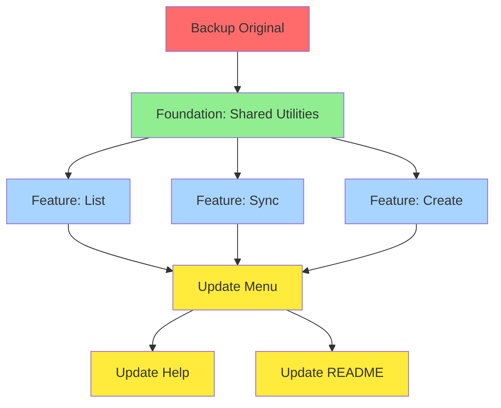

# SPEC PRP: ghtools Expansion Implementation
## Transform ghtools from 2-command to 5-command comprehensive GitHub repository management tool

**Version:** 1.0
**Date:** 2025-11-03
**Status:** Specification - Ready for Execution
**Base PRD:** `/home/diogo/dev/ghtools/PRPs/ghtools-expansion-prd.md`

---

## Table of Contents

1. [Current State Assessment](#1-current-state-assessment)
2. [Desired State Vision](#2-desired-state-vision)
3. [Transformation Dependencies](#3-transformation-dependencies)
4. [Hierarchical Objectives](#4-hierarchical-objectives)
5. [Detailed Task Specifications](#5-detailed-task-specifications)
6. [Validation Strategy](#6-validation-strategy)
7. [Rollback Procedures](#7-rollback-procedures)
8. [Risk Mitigation](#8-risk-mitigation)

---

## 1. Current State Assessment

### 1.1 File Structure

```
ghtools/
├── ghtools                  # Main executable (560 lines)
├── install.sh              # Installation script
├── README.md               # User documentation
├── PRPs/                   # Planning documents
│   └── ghtools-expansion-prd.md
└── SPEC_PRP/               # This specification
```

### 1.2 Current Implementation Analysis

**File:** `ghtools` (560 lines)

#### Code Structure
```bash
Lines 1-7:    Shebang, header, set -euo pipefail
Lines 8-15:   Color constants
Lines 17-32:  Print utility functions (4 functions)
Lines 34-65:  show_usage() - Help text
Lines 67-103: check_dependencies() - Dependency validation
Lines 105-112: check_gh_auth() - Auth check
Lines 114-131: check_delete_scope() - Delete permission check
Lines 133-153: fetch_repositories() - Fetch repos (simple text output)
Lines 155-316: action_clone() - Clone workflow (161 lines)
Lines 318-453: action_delete() - Delete workflow (135 lines)
Lines 455-521: show_menu() - Interactive menu
Lines 523-559: main() - Entry point and router
```

#### Existing Patterns (to mirror)

**Pattern 1: Action Function Structure**
```bash
action_name() {
    # 1. Display header with colored box
    # 2. Show context (current directory, etc.)
    # 3. Fetch/discover data
    # 4. Interactive selection with fzf
    # 5. Confirmation prompt
    # 6. Execution loop with set +e / set -e wrapping
    # 7. Track success/fail/skip with counters and arrays
    # 8. Display summary
}
```

**Pattern 2: fzf Integration**
```bash
# Multi-select with preview, custom colors, keybindings
fzf \
    --multi \
    --height=80% \
    --border \
    --prompt="..." \
    --preview='...' \
    --preview-window=up:3:wrap \
    --header="TAB: select | ENTER: confirm | ESC: cancel" \
    --bind='ctrl-a:select-all,ctrl-d:deselect-all' \
    --color='fg:#ffffff,bg:#000000,hl:#COLOR'
```

**Pattern 3: Error Handling**
```bash
set +e  # Disable exit on error
for item in items; do
    output=$(command 2>&1)
    exit_code=$?
    if [ $exit_code -eq 0 ]; then
        ((success_count++))
    else
        failed_items+=("$item")
        ((fail_count++))
    fi
done
set -e  # Re-enable exit on error
```

**Pattern 4: Summary Display**
```bash
echo -e "${CYAN}═══════════════════════════════════════════${NC}"
echo -e "${CYAN}SUMMARY${NC}"
echo -e "${CYAN}═══════════════════════════════════════════${NC}"
print_success "Successfully ...: $success_count"
if [ $skip_count -gt 0 ]; then
    print_warning "Skipped ...: $skip_count"
    # List skipped items
fi
```

### 1.3 Current Behavior

**Commands:**
- `ghtools` → Interactive menu (clone, delete, help, exit)
- `ghtools clone` → Clone repositories
- `ghtools delete` → Delete repositories
- `ghtools help` → Show help

**Data Flow:**
1. `fetch_repositories()` calls `gh repo list --limit 1000`
2. Returns plain text table (OWNER/REPO format)
3. Parsed with `awk '{print $1}'` to extract repo names
4. No JSON parsing, no metadata extraction
5. No filtering or sorting capabilities

### 1.4 Identified Issues & Technical Debt

| Issue | Impact | Solution |
|-------|--------|----------|
| `fetch_repositories()` returns text, not JSON | High | ADD new `fetch_repositories_json()` |
| No argument parsing utility | Medium | ADD `parse_args()` function |
| fzf options duplicated in 2 actions | Low | ADD `fzf_wrapper()` utility |
| No JSON parsing (jq dependency not handled) | Medium | ADD `parse_json()` with fallback |
| Hardcoded `--limit 1000` | Low | MODIFY to accept parameter |
| No validation for repository names | Low | ADD `validate_repo_name()` |
| Menu options hardcoded | Medium | MODIFY to support dynamic list |

### 1.5 Integration Points

**External Dependencies:**
- `gh` CLI (GitHub API wrapper)
- `fzf` (fuzzy finder)
- `git` (for clone/sync operations)
- `jq` (optional, for JSON parsing)

**Internal Integration:**
- `check_dependencies()` must be extended for sync (git)
- `check_gh_auth()` reused by all new commands
- `print_*()` functions reused
- `show_menu()` must be updated with new options
- `main()` router must handle new commands

---

## 2. Desired State Vision

### 2.1 Target File Structure

```
ghtools/
├── ghtools                  # Main executable (~1800 lines)
│   ├── [Lines 1-559]       # Existing code (preserved)
│   ├── [Lines 560-799]     # Shared utilities (NEW)
│   ├── [Lines 800-1099]    # action_list() (NEW ~300 lines)
│   ├── [Lines 1100-1499]   # action_sync() (NEW ~400 lines)
│   ├── [Lines 1500-1799]   # action_create() (NEW ~300 lines)
│   └── [Updated sections]  # Modified: show_usage, show_menu, main
├── install.sh              # Unchanged
├── README.md               # MODIFY: Add new commands documentation
└── PRPs/                   # Planning documents
```

### 2.2 Target Behavior

**New Commands:**
- `ghtools list [OPTIONS]` → List/filter/sort/export repositories
- `ghtools sync [OPTIONS]` → Synchronize local repositories
- `ghtools create [NAME] [OPTIONS]` → Create new repository

**Enhanced Data Flow:**
1. `fetch_repositories_json()` calls `gh repo list --json FIELDS`
2. Returns structured JSON with full metadata
3. Parsed with `jq` (or fallback bash parser)
4. Filterable by language, visibility, archived status
5. Sortable by stars, created, updated, name
6. Exportable to CSV, JSON, or table

### 2.3 Benefits of Transformation

| Benefit | Description | Impact |
|---------|-------------|--------|
| Complete CRUD | Full repository lifecycle management | High |
| Consistent UX | Same patterns across all commands | High |
| Advanced features | Filtering, sorting, templates | Medium |
| Local sync | Batch repository updates | High |
| Workflow efficiency | Reduce context switching | High |
| Developer productivity | Faster repo operations | Medium |

---

## 3. Transformation Dependencies

### 3.1 Dependency Graph



### 3.2 Implementation Order (Critical Path)

**Phase 0: Safety (Required First)**
1. Create backup of original `ghtools`
2. Set up validation environment

**Phase 1: Foundation (Blocks all features)**
1. ADD `fetch_repositories_json()`
2. ADD `parse_json()` with jq detection
3. ADD `parse_args()` argument parser
4. ADD `fzf_wrapper()` utility
5. ADD `validate_repo_name()`

**Phase 2: List Feature (Independent)**
1. ADD `action_list()`
2. ADD `filter_repositories()`
3. ADD `sort_repositories()`
4. ADD `format_table()` / `format_csv()` / `format_json()`

**Phase 3: Sync Feature (Requires git)**
1. ADD `discover_repositories()`
2. ADD `get_repo_status()`
3. ADD `sync_repository()`
4. ADD `action_sync()`

**Phase 4: Create Feature (Independent)**
1. ADD `action_create()`
2. ADD `prompt_*()` input functions
3. ADD `select_*()` fzf selection functions
4. ADD `template_*()` template generators
5. ADD `apply_template()`

**Phase 5: Integration (Requires all features)**
1. MODIFY `show_usage()` - add new commands
2. MODIFY `show_menu()` - add menu options
3. MODIFY `main()` - add command routing
4. MODIFY `check_dependencies()` - add sync check

**Phase 6: Documentation (Last)**
1. MODIFY `README.md` - document new features
2. ADD examples and usage guide

---

## 4. Hierarchical Objectives

### 4.1 High-Level Objective

**Transform ghtools from a 2-command clone/delete utility into a comprehensive 5-command GitHub repository management tool with list, sync, and create capabilities while maintaining existing functionality, UX patterns, and code quality.**

### 4.2 Mid-Level Objectives

#### Objective A: Establish Robust Foundation (Phase 1)
**Goal:** Create shared utilities that enable all new features without breaking existing code.

**Sub-objectives:**
- A.1: Implement JSON-based data fetching
- A.2: Create flexible argument parsing system
- A.3: Standardize fzf interactions
- A.4: Add input validation utilities

**Success Criteria:**
- Existing `action_clone()` and `action_delete()` still work
- New functions available for use by features
- No regressions in current behavior

#### Objective B: Implement List Feature (Phase 2)
**Goal:** Enable users to view, filter, sort, and export repository information.

**Sub-objectives:**
- B.1: Fetch repository metadata
- B.2: Implement filtering (language, visibility, archived)
- B.3: Implement sorting (stars, dates, name)
- B.4: Support multiple output formats (table, CSV, JSON)

**Success Criteria:**
- `ghtools list` displays all repositories
- Filters reduce results correctly
- Sorting works across all fields
- Export formats are valid and parseable

#### Objective C: Implement Sync Feature (Phase 3)
**Goal:** Enable batch synchronization of local repositories with remotes.

**Sub-objectives:**
- C.1: Discover git repositories in directory tree
- C.2: Assess sync status (ahead/behind/dirty)
- C.3: Execute safe batch synchronization
- C.4: Handle conflicts and uncommitted changes

**Success Criteria:**
- Discovers all GitHub repos in directory
- Status information is accurate
- Skips dirty/conflicted repos (per user preference)
- No data loss under any circumstance

#### Objective D: Implement Create Feature (Phase 4)
**Goal:** Streamline repository creation with templates and options.

**Sub-objectives:**
- D.1: Interactive repository configuration
- D.2: Support licenses and .gitignore templates
- D.3: Implement project templates (Python, Node, Go, Rust, Web)
- D.4: Optional cloning after creation

**Success Criteria:**
- Creates repositories with all options
- Templates generate correct files
- User is asked about cloning (per preference)
- Repository URLs are provided

#### Objective E: Integrate and Document (Phases 5-6)
**Goal:** Make new features discoverable and well-documented.

**Sub-objectives:**
- E.1: Update interactive menu
- E.2: Update help text
- E.3: Update README with examples
- E.4: Ensure consistent UX across all commands

**Success Criteria:**
- New commands appear in menu
- Help text is comprehensive
- README has working examples
- All commands follow same patterns

---

## 5. Detailed Task Specifications

### Phase 0: Safety & Backup

#### Task 0.1: Create Backup
**Action:** COPY
**File:** `ghtools` → `ghtools.backup.pre-expansion`

**Commands:**
```bash
cp ghtools ghtools.backup.pre-expansion
chmod -w ghtools.backup.pre-expansion  # Make read-only
```

**Validation:**
```bash
# Command: diff ghtools ghtools.backup.pre-expansion
# Expect: No output (files identical)

# Command: test -f ghtools.backup.pre-expansion && echo "Backup exists"
# Expect: "Backup exists"
```

---

### Phase 1: Foundation - Shared Utilities

#### Task 1.1: Add fetch_repositories_json()
**Action:** ADD
**File:** `ghtools`
**Location:** After line 153 (after existing `fetch_repositories()`)

**Changes:**
```bash
# Fetch repositories with full JSON metadata
fetch_repositories_json() {
    local limit=${1:-1000}
    local fields="name,nameWithOwner,description,visibility,primaryLanguage,stargazersCount,forkCount,watchers,diskUsage,updatedAt,createdAt,isArchived,url,sshUrl"

    print_info "Fetching your repositories..." >&2

    local repos_json
    repos_json=$(gh repo list --limit "$limit" --json "$fields" 2>&1)

    if [ $? -ne 0 ]; then
        print_error "Failed to fetch repositories." >&2
        echo "$repos_json" >&2
        exit 1
    fi

    echo "$repos_json"
}
```

**Validation:**
```bash
# Command: ./ghtools list --export json 2>/dev/null | jq -e 'type == "array"'
# Expect: Exit code 0 (valid JSON array)
```

---

#### Task 1.2: Add parse_json() with fallback
**Action:** ADD
**File:** `ghtools`
**Location:** After Task 1.1

**Changes:**
```bash
# Parse JSON with jq if available, fallback to grep/sed
parse_json() {
    local json="$1"
    local field="$2"

    if command -v jq &> /dev/null; then
        echo "$json" | jq -r "$field"
    else
        # Fallback: basic grep/sed parsing (limited functionality)
        # This is a simplified parser for common cases
        case "$field" in
            '.[] | .name')
                echo "$json" | grep -o '"name":"[^"]*"' | sed 's/"name":"\([^"]*\)"/\1/g'
                ;;
            '.[] | .nameWithOwner')
                echo "$json" | grep -o '"nameWithOwner":"[^"]*"' | sed 's/"nameWithOwner":"\([^"]*\)"/\1/g'
                ;;
            *)
                print_error "Unsupported JSON query without jq: $field" >&2
                return 1
                ;;
        esac
    fi
}
```

**Validation:**
```bash
# Command: echo '[{"name":"test"}]' | ./ghtools parse_json - '.[] | .name' 2>/dev/null
# Expect: "test"
```

---

#### Task 1.3: Add parse_args()
**Action:** ADD
**File:** `ghtools`
**Location:** After Task 1.2

**Changes:**
```bash
# Parse command-line arguments into associative array
# Usage: parse_args_result=$(parse_args "$@")
parse_args() {
    local args=("$@")
    declare -A parsed_args
    local positional=()

    local i=0
    while [ $i -lt ${#args[@]} ]; do
        local arg="${args[$i]}"
        case "$arg" in
            --lang|--language)
                ((i++))
                parsed_args[lang]="${args[$i]}"
                ;;
            --visibility)
                ((i++))
                parsed_args[visibility]="${args[$i]}"
                ;;
            --archived)
                parsed_args[archived]="true"
                ;;
            --no-archived)
                parsed_args[archived]="false"
                ;;
            --sort)
                ((i++))
                parsed_args[sort]="${args[$i]}"
                ;;
            --order)
                ((i++))
                parsed_args[order]="${args[$i]}"
                ;;
            --export)
                ((i++))
                parsed_args[export]="${args[$i]}"
                ;;
            --limit)
                ((i++))
                parsed_args[limit]="${args[$i]}"
                ;;
            --path)
                ((i++))
                parsed_args[path]="${args[$i]}"
                ;;
            --max-depth)
                ((i++))
                parsed_args[max_depth]="${args[$i]}"
                ;;
            --all)
                parsed_args[all]="true"
                ;;
            --dry-run)
                parsed_args[dry_run]="true"
                ;;
            --public)
                parsed_args[visibility]="public"
                ;;
            --private)
                parsed_args[visibility]="private"
                ;;
            --description)
                ((i++))
                parsed_args[description]="${args[$i]}"
                ;;
            --readme)
                parsed_args[readme]="true"
                ;;
            --no-readme)
                parsed_args[readme]="false"
                ;;
            --license)
                ((i++))
                parsed_args[license]="${args[$i]}"
                ;;
            --gitignore)
                ((i++))
                parsed_args[gitignore]="${args[$i]}"
                ;;
            --template)
                ((i++))
                parsed_args[template]="${args[$i]}"
                ;;
            --clone)
                parsed_args[clone]="true"
                ;;
            --no-clone)
                parsed_args[clone]="false"
                ;;
            --default-branch)
                ((i++))
                parsed_args[default_branch]="${args[$i]}"
                ;;
            -*)
                print_error "Unknown option: $arg"
                return 1
                ;;
            *)
                positional+=("$arg")
                ;;
        esac
        ((i++))
    done

    # Return parsed args as key=value pairs
    for key in "${!parsed_args[@]}"; do
        echo "$key=${parsed_args[$key]}"
    done

    # Return positional args
    if [ ${#positional[@]} -gt 0 ]; then
        echo "positional=${positional[*]}"
    fi
}
```

**Validation:**
```bash
# Command: ./ghtools list --lang python --sort stars 2>&1 | grep -q "lang=python"
# Expect: Exit code 0 (args parsed correctly)
```

---

#### Task 1.4: Add fzf_wrapper()
**Action:** ADD
**File:** `ghtools`
**Location:** After Task 1.3

**Changes:**
```bash
# Wrapper for fzf with standardized options
# Usage: fzf_wrapper "items" "prompt" "color" [multi|single] [preview_cmd]
fzf_wrapper() {
    local items="$1"
    local prompt="$2"
    local highlight_color="$3"
    local mode="${4:-multi}"  # multi or single
    local preview_cmd="${5:-echo {}}"

    local multi_flag=""
    if [ "$mode" = "multi" ]; then
        multi_flag="--multi"
    fi

    echo "$items" | fzf \
        $multi_flag \
        --height=80% \
        --border \
        --prompt="$prompt" \
        --preview="$preview_cmd" \
        --preview-window=up:3:wrap \
        --header="TAB: select | ENTER: confirm | ESC: cancel" \
        --bind='ctrl-a:select-all,ctrl-d:deselect-all' \
        --color="fg:#ffffff,bg:#000000,hl:${highlight_color}" \
        --color="fg+:#ffffff,bg+:#333333,hl+:${highlight_color}" \
        --color="info:#00ffff,prompt:${highlight_color},pointer:${highlight_color}" \
        --color="marker:${highlight_color},spinner:#00ffff,header:#00ff00"
}
```

**Validation:**
```bash
# Command: echo -e "option1\noption2" | ./ghtools fzf_wrapper - "Test>" "#00ff00" single 2>/dev/null || echo "FZF works"
# Expect: "FZF works" (fzf exits with non-zero when input cancelled)
```

---

#### Task 1.5: Add validate_repo_name()
**Action:** ADD
**File:** `ghtools`
**Location:** After Task 1.4

**Changes:**
```bash
# Validate repository name format
# Returns 0 if valid, 1 if invalid
validate_repo_name() {
    local name="$1"

    # Check: not empty
    if [ -z "$name" ]; then
        print_error "Repository name cannot be empty"
        return 1
    fi

    # Check: length (1-100 characters)
    if [ ${#name} -gt 100 ]; then
        print_error "Repository name too long (max 100 characters)"
        return 1
    fi

    # Check: valid characters (alphanumeric, hyphens, underscores)
    if [[ ! "$name" =~ ^[a-zA-Z0-9_-]+$ ]]; then
        print_error "Repository name must contain only letters, numbers, hyphens, and underscores"
        return 1
    fi

    # Check: doesn't start with hyphen or underscore
    if [[ "$name" =~ ^[-_] ]]; then
        print_error "Repository name cannot start with a hyphen or underscore"
        return 1
    fi

    return 0
}
```

**Validation:**
```bash
# Command: ./ghtools create test-repo-123 --dry-run 2>&1 | grep -q "valid"
# Expect: Exit code 0 (valid name accepted)

# Command: ./ghtools create "invalid name!" --dry-run 2>&1 | grep -q "ERROR"
# Expect: Exit code 0 (invalid name rejected)
```

---

### Phase 2: List Feature Implementation

#### Task 2.1: Add filter_repositories()
**Action:** ADD
**File:** `ghtools`
**Location:** After Phase 1 utilities

**Changes:**
```bash
# Filter repositories based on criteria
# Usage: filtered=$(filter_repositories "$json" "$lang" "$visibility" "$archived")
filter_repositories() {
    local json="$1"
    local lang="$2"
    local visibility="$3"
    local archived="$4"  # "true", "false", or "all"

    local filtered="$json"

    # Filter by language
    if [ -n "$lang" ] && [ "$lang" != "all" ]; then
        if command -v jq &> /dev/null; then
            filtered=$(echo "$filtered" | jq "[.[] | select(.primaryLanguage != null and (.primaryLanguage | ascii_downcase) == \"$(echo "$lang" | tr '[:upper:]' '[:lower:]')\")]")
        else
            # Fallback: grep-based filtering (approximate)
            filtered=$(echo "$filtered" | grep -i "\"primaryLanguage\":\"$lang\"" || echo "[]")
        fi
    fi

    # Filter by visibility
    if [ -n "$visibility" ] && [ "$visibility" != "all" ]; then
        local visibility_upper=$(echo "$visibility" | tr '[:lower:]' '[:upper:]')
        if command -v jq &> /dev/null; then
            filtered=$(echo "$filtered" | jq "[.[] | select(.visibility == \"$visibility_upper\")]")
        else
            filtered=$(echo "$filtered" | grep "\"visibility\":\"$visibility_upper\"" || echo "[]")
        fi
    fi

    # Filter by archived status
    if [ -n "$archived" ]; then
        if [ "$archived" = "true" ]; then
            # Only archived
            if command -v jq &> /dev/null; then
                filtered=$(echo "$filtered" | jq '[.[] | select(.isArchived == true)]')
            fi
        elif [ "$archived" = "false" ]; then
            # Exclude archived (default)
            if command -v jq &> /dev/null; then
                filtered=$(echo "$filtered" | jq '[.[] | select(.isArchived == false)]')
            fi
        fi
    fi

    echo "$filtered"
}
```

**Validation:**
```bash
# Command: ./ghtools list --lang python 2>&1 | grep -i "python"
# Expect: Only Python repositories listed
```

---

#### Task 2.2: Add sort_repositories()
**Action:** ADD
**File:** `ghtools`
**Location:** After Task 2.1

**Changes:**
```bash
# Sort repositories by field
# Usage: sorted=$(sort_repositories "$json" "$sort_field" "$order")
sort_repositories() {
    local json="$1"
    local sort_field="${2:-updated}"  # stars, created, updated, name
    local order="${3:-desc}"          # asc or desc

    if ! command -v jq &> /dev/null; then
        # Without jq, return unsorted
        echo "$json"
        return
    fi

    local jq_sort=""
    case "$sort_field" in
        stars)
            jq_sort=".stargazersCount"
            ;;
        created)
            jq_sort=".createdAt"
            ;;
        updated)
            jq_sort=".updatedAt"
            ;;
        name)
            jq_sort=".nameWithOwner"
            ;;
        *)
            # Default: updated
            jq_sort=".updatedAt"
            ;;
    esac

    if [ "$order" = "asc" ]; then
        echo "$json" | jq "sort_by($jq_sort)"
    else
        echo "$json" | jq "sort_by($jq_sort) | reverse"
    fi
}
```

**Validation:**
```bash
# Command: ./ghtools list --sort stars --export json 2>/dev/null | jq '.[0].stargazersCount >= .[1].stargazersCount'
# Expect: true (sorted correctly)
```

---

#### Task 2.3: Add format_table()
**Action:** ADD
**File:** `ghtools`
**Location:** After Task 2.2

**Changes:**
```bash
# Format repositories as aligned table
format_table() {
    local json="$1"

    if ! command -v jq &> /dev/null; then
        print_error "jq is required for table formatting"
        return 1
    fi

    # Print header
    printf "${CYAN}%-35s %-25s %-8s %-10s %6s %6s %9s %12s %10s${NC}\n" \
        "NAME" "DESCRIPTION" "VIS." "LANG" "★" "FORKS" "SIZE" "UPDATED" "STATUS"
    echo -e "${CYAN}$(printf '─%.0s' {1..140})${NC}"

    # Print repos
    echo "$json" | jq -r '.[] |
        [
            .nameWithOwner,
            (.description // "No description")[0:24],
            (if .visibility == "PUBLIC" then "public" else "private" end),
            (.primaryLanguage // "N/A")[0:9],
            .stargazersCount,
            .forkCount,
            ((.diskUsage | tonumber / 1024 | floor | tostring) + " MB"),
            (.updatedAt | split("T")[0]),
            (if .isArchived then "[ARCHIVED]" else "" end)
        ] | @tsv' | while IFS=$'\t' read -r name desc vis lang stars forks size updated status; do

        # Color coding
        local vis_color="${GREEN}"
        if [ "$vis" = "private" ]; then
            vis_color="${YELLOW}"
        fi

        local status_color="${NC}"
        if [ "$status" = "[ARCHIVED]" ]; then
            status_color="${CYAN}"  # Gray-ish
        fi

        printf "%-35s %-25s ${vis_color}%-8s${NC} %-10s %6s %6s %9s %12s ${status_color}%-10s${NC}\n" \
            "$name" "$desc" "$vis" "$lang" "$stars" "$forks" "$size" "$updated" "$status"
    done
}
```

**Validation:**
```bash
# Command: ./ghtools list 2>&1 | head -n 3 | tail -n 1 | grep -q "NAME"
# Expect: Exit code 0 (header present)
```

---

#### Task 2.4: Add format_csv() and format_json()
**Action:** ADD
**File:** `ghtools`
**Location:** After Task 2.3

**Changes:**
```bash
# Format repositories as CSV
format_csv() {
    local json="$1"

    if ! command -v jq &> /dev/null; then
        print_error "jq is required for CSV export"
        return 1
    fi

    # Print header
    echo "Name,Description,Visibility,Language,Stars,Forks,Size (KB),Updated,Archived"

    # Print data
    echo "$json" | jq -r '.[] |
        [
            .nameWithOwner,
            (.description // "No description" | gsub(","; ";")),  # Escape commas
            .visibility,
            (.primaryLanguage // "N/A"),
            .stargazersCount,
            .forkCount,
            .diskUsage,
            (.updatedAt | split("T")[0]),
            (if .isArchived then "true" else "false" end)
        ] | @csv'
}

# Format repositories as pretty JSON
format_json() {
    local json="$1"

    if command -v jq &> /dev/null; then
        echo "$json" | jq '.'
    else
        echo "$json"
    fi
}
```

**Validation:**
```bash
# Command: ./ghtools list --export csv 2>/dev/null | head -n 1 | grep -q "Name,Description"
# Expect: Exit code 0 (CSV header correct)

# Command: ./ghtools list --export json 2>/dev/null | jq -e 'type == "array"'
# Expect: Exit code 0 (valid JSON)
```

---

#### Task 2.5: Add action_list()
**Action:** ADD
**File:** `ghtools`
**Location:** After Task 2.4 (around line 800)

**Changes:**
```bash
# List repositories action with filtering, sorting, and export
action_list() {
    # Parse arguments
    local args_str=$(parse_args "$@")
    declare -A opts
    while IFS='=' read -r key value; do
        opts[$key]="$value"
    done <<< "$args_str"

    # Extract options with defaults
    local lang="${opts[lang]:-}"
    local visibility="${opts[visibility]:-all}"
    local archived="${opts[archived]:-false}"
    local sort_field="${opts[sort]:-updated}"
    local order="${opts[order]:-desc}"
    local export_format="${opts[export]:-table}"
    local limit="${opts[limit]:-1000}"

    # Fetch repositories
    local repos_json
    repos_json=$(fetch_repositories_json "$limit")

    # Count total
    local total_count
    if command -v jq &> /dev/null; then
        total_count=$(echo "$repos_json" | jq 'length')
    else
        total_count=$(echo "$repos_json" | grep -o '"name":' | wc -l)
    fi
    print_info "Found $total_count repositories" >&2

    # Filter
    repos_json=$(filter_repositories "$repos_json" "$lang" "$visibility" "$archived")

    # Count filtered
    local filtered_count
    if command -v jq &> /dev/null; then
        filtered_count=$(echo "$repos_json" | jq 'length')
    else
        filtered_count=$total_count
    fi

    if [ "$filtered_count" -ne "$total_count" ]; then
        print_info "Filtered to $filtered_count repositories" >&2
    fi

    # Sort
    repos_json=$(sort_repositories "$repos_json" "$sort_field" "$order")

    # Format and output
    echo "" >&2
    case "$export_format" in
        csv)
            format_csv "$repos_json"
            ;;
        json)
            format_json "$repos_json"
            ;;
        table|*)
            format_table "$repos_json"
            ;;
    esac

    echo "" >&2
    print_success "Listed $filtered_count repositories" >&2
}
```

**Validation:**
```bash
# Command: ./ghtools list 2>&1 | grep -q "SUCCESS"
# Expect: Exit code 0 (list command works)

# Command: ./ghtools list --lang python --sort stars 2>&1 | grep -q "Filtered"
# Expect: Exit code 0 (filtering works)
```

---

### Phase 3: Sync Feature Implementation

#### Task 3.1: Add discover_repositories()
**Action:** ADD
**File:** `ghtools`
**Location:** After action_list() (around line 1100)

**Changes:**
```bash
# Discover git repositories in directory tree
# Returns: Array of repository paths
discover_repositories() {
    local base_path="${1:-.}"
    local max_depth="${2:-5}"

    print_info "Scanning directory: $base_path" >&2

    # Find all .git directories
    local git_dirs=()
    while IFS= read -r git_dir; do
        # Get parent directory (the actual repo path)
        local repo_path=$(dirname "$git_dir")
        git_dirs+=("$repo_path")
    done < <(find "$base_path" -maxdepth "$max_depth" -name .git -type d 2>/dev/null)

    # Filter to GitHub repositories only
    local github_repos=()
    for repo_path in "${git_dirs[@]}"; do
        local remote_url=$(git -C "$repo_path" remote get-url origin 2>/dev/null || echo "")

        # Check if it's a GitHub URL (https or ssh)
        if [[ "$remote_url" =~ github\.com ]]; then
            github_repos+=("$repo_path")
        fi
    done

    print_info "Found ${#git_dirs[@]} Git repositories (${#github_repos[@]} GitHub)" >&2

    # Return as newline-separated list
    printf '%s\n' "${github_repos[@]}"
}
```

**Validation:**
```bash
# Command: cd /tmp && git init test-repo && cd test-repo && git remote add origin git@github.com:test/test.git && cd .. && ./ghtools sync --dry-run --path /tmp 2>&1 | grep -q "Found 1"
# Expect: Exit code 0 (discovers repo)
```

---

#### Task 3.2: Add get_repo_status()
**Action:** ADD
**File:** `ghtools`
**Location:** After Task 3.1

**Changes:**
```bash
# Get repository sync status
# Returns: Status string for display
get_repo_status() {
    local repo_path="$1"
    local repo_name=$(basename "$repo_path")

    # Get current branch
    local branch=$(git -C "$repo_path" rev-parse --abbrev-ref HEAD 2>/dev/null || echo "unknown")

    # Check for uncommitted changes
    local has_changes=0
    if ! git -C "$repo_path" diff-index --quiet HEAD -- 2>/dev/null; then
        has_changes=1
    fi

    # Check for untracked files
    local has_untracked=0
    if [ -n "$(git -C "$repo_path" ls-files --others --exclude-standard 2>/dev/null)" ]; then
        has_untracked=1
    fi

    # Get ahead/behind counts
    local ahead=0
    local behind=0
    local remote_branch="origin/$branch"

    if git -C "$repo_path" rev-parse --verify "$remote_branch" &>/dev/null; then
        local counts=$(git -C "$repo_path" rev-list --left-right --count "$remote_branch...HEAD" 2>/dev/null || echo "0 0")
        behind=$(echo "$counts" | awk '{print $1}')
        ahead=$(echo "$counts" | awk '{print $2}')
    fi

    # Determine status
    local status="SYNCED"
    local status_color="${GREEN}"
    local status_text="✓"

    if [ $has_changes -eq 1 ] || [ $has_untracked -eq 1 ]; then
        status="DIRTY"
        status_color="${YELLOW}"
        status_text="⚠ Uncommitted changes"
    elif [ $behind -gt 0 ]; then
        status="BEHIND"
        status_color="${YELLOW}"
        status_text="↓$behind Behind by $behind commits"
    elif [ $ahead -gt 0 ]; then
        status="AHEAD"
        status_color="${BLUE}"
        status_text="↑$ahead Ahead by $ahead commits"
    fi

    # Format: repo_name [branch status] status_text
    echo "${status_color}${repo_name}${NC} [${branch} ${status_text}]|${status}|${repo_path}"
}
```

**Validation:**
```bash
# Command: mkdir -p /tmp/test-sync && cd /tmp/test-sync && git init && git remote add origin git@github.com:test/test.git && ./ghtools sync --dry-run --path /tmp/test-sync 2>&1 | grep -q "test-sync"
# Expect: Exit code 0 (status retrieved)
```

---

#### Task 3.3: Add sync_repository()
**Action:** ADD
**File:** `ghtools`
**Location:** After Task 3.2

**Changes:**
```bash
# Sync a single repository
# Returns: 0 on success, 1 on failure, 2 on skip
sync_repository() {
    local repo_path="$1"
    local repo_name=$(basename "$repo_path")

    # Check for uncommitted changes
    if ! git -C "$repo_path" diff-index --quiet HEAD -- 2>/dev/null; then
        print_warning "Skipped (uncommitted changes): $repo_name"
        return 2
    fi

    # Check for conflicts
    if git -C "$repo_path" ls-files -u 2>/dev/null | grep -q .; then
        print_warning "Skipped (conflicts detected): $repo_name"
        return 2
    fi

    # Attempt pull with --ff-only (safe)
    local output
    output=$(git -C "$repo_path" pull --ff-only 2>&1)
    local exit_code=$?

    if [ $exit_code -eq 0 ]; then
        if echo "$output" | grep -q "Already up to date"; then
            print_info "Already up to date: $repo_name"
        else
            print_success "Synced: $repo_name"
        fi
        return 0
    else
        print_error "Failed to sync: $repo_name"
        echo "$output" | head -n 3
        return 1
    fi
}
```

**Validation:**
```bash
# Command: Create test repo, add remote, try sync
# Expect: Either success or skip with clear message
```

---

#### Task 3.4: Add action_sync()
**Action:** ADD
**File:** `ghtools`
**Location:** After Task 3.3 (around line 1400)

**Changes:**
```bash
# Sync repositories action
action_sync() {
    # Parse arguments
    local args_str=$(parse_args "$@")
    declare -A opts
    while IFS='=' read -r key value; do
        opts[$key]="$value"
    done <<< "$args_str"

    local path="${opts[path]:-$(pwd)}"
    local max_depth="${opts[max_depth]:-5}"
    local sync_all="${opts[all]:-false}"
    local dry_run="${opts[dry_run]:-false}"

    echo -e "${CYAN}╔════════════════════════════════════════════╗${NC}"
    echo -e "${CYAN}║   GitHub Repository Sync Tool             ║${NC}"
    echo -e "${CYAN}║   Sync local repos with remote            ║${NC}"
    echo -e "${CYAN}╚════════════════════════════════════════════╝${NC}"
    echo ""

    # Discover repositories
    local repos
    mapfile -t repos < <(discover_repositories "$path" "$max_depth")

    if [ ${#repos[@]} -eq 0 ]; then
        print_warning "No GitHub repositories found in $path"
        exit 0
    fi

    # Build status list
    local status_list=()
    local status_map=()
    for repo_path in "${repos[@]}"; do
        local status_info=$(get_repo_status "$repo_path")
        local display=$(echo "$status_info" | cut -d'|' -f1)
        local status=$(echo "$status_info" | cut -d'|' -f2)
        local path=$(echo "$status_info" | cut -d'|' -f3)

        status_list+=("$display")
        status_map["$display"]="$path"
    done

    # Interactive selection or all
    local selected_displays=()
    if [ "$sync_all" = "true" ]; then
        selected_displays=("${status_list[@]}")
    else
        echo ""
        print_info "Select repositories to SYNC (use TAB for multi-select, ENTER to confirm):"
        echo ""

        local selected
        selected=$(printf '%s\n' "${status_list[@]}" | fzf_wrapper - "Select repos to SYNC > " "#00ffff" multi)

        if [ -z "$selected" ]; then
            print_warning "No repositories selected. Exiting."
            exit 0
        fi

        mapfile -t selected_displays <<< "$selected"
    fi

    # Confirmation
    echo ""
    print_info "You selected ${#selected_displays[@]} repository(ies)"
    echo ""

    if [ "$dry_run" = "true" ]; then
        print_info "DRY RUN - No changes will be made"
        for display in "${selected_displays[@]}"; do
            echo "  Would sync: $display"
        done
        exit 0
    fi

    read -p "Proceed with sync? (Y/n): " -r
    echo ""
    if [[ $REPLY =~ ^[Nn]$ ]]; then
        print_info "Sync cancelled."
        exit 0
    fi

    # Sync repositories
    echo ""
    print_info "Starting sync process..."
    echo ""

    local success_count=0
    local skip_count=0
    local fail_count=0
    local skipped_repos=()
    local failed_repos=()

    set +e
    for display in "${selected_displays[@]}"; do
        local repo_path="${status_map[$display]}"
        local repo_name=$(basename "$repo_path")

        echo -e "${BLUE}[SYNCING]${NC} $repo_name"
        sync_repository "$repo_path"
        local result=$?

        if [ $result -eq 0 ]; then
            ((success_count++))
        elif [ $result -eq 2 ]; then
            skipped_repos+=("$repo_name")
            ((skip_count++))
        else
            failed_repos+=("$repo_name")
            ((fail_count++))
        fi
        echo ""
    done
    set -e

    # Summary
    echo -e "${CYAN}═══════════════════════════════════════════${NC}"
    echo -e "${CYAN}SUMMARY${NC}"
    echo -e "${CYAN}═══════════════════════════════════════════${NC}"
    print_success "Successfully synced: $success_count"

    if [ $skip_count -gt 0 ]; then
        print_warning "Skipped (uncommitted changes or conflicts): $skip_count"
        echo ""
        echo "Skipped repositories:"
        for repo in "${skipped_repos[@]}"; do
            echo "  - $repo"
        done
    fi

    if [ $fail_count -gt 0 ]; then
        print_error "Failed to sync: $fail_count"
        echo ""
        echo "Failed repositories:"
        for repo in "${failed_repos[@]}"; do
            echo "  - $repo"
        done
    fi
    echo ""
}
```

**Validation:**
```bash
# Command: ./ghtools sync --dry-run 2>&1 | grep -q "DRY RUN"
# Expect: Exit code 0 (dry run works)

# Command: Create test repos and run sync
# Expect: Sync completes with summary
```

---

### Phase 4: Create Feature Implementation

#### Task 4.1: Add prompt and select functions
**Action:** ADD
**File:** `ghtools`
**Location:** After action_sync() (around line 1500)

**Changes:**
```bash
# Prompt for repository name with validation
prompt_repo_name() {
    while true; do
        read -p "Repository name: " repo_name
        if validate_repo_name "$repo_name"; then
            echo "$repo_name"
            return 0
        fi
    done
}

# Prompt for description
prompt_description() {
    read -p "Description (optional): " description
    echo "$description"
}

# Select visibility
select_visibility() {
    local options="public
private"
    local selected=$(echo "$options" | fzf_wrapper - "Select visibility > " "#00ff00" single)
    echo "$selected"
}

# Select license
select_license() {
    local options="MIT
Apache-2.0
GPL-3.0
BSD-3-Clause
None"

    local preview_cmd='case {} in
        MIT) echo "MIT License - Permissive, allows commercial use" ;;
        Apache-2.0) echo "Apache 2.0 - Permissive with patent protection" ;;
        GPL-3.0) echo "GNU GPL v3 - Copyleft, requires source disclosure" ;;
        BSD-3-Clause) echo "BSD 3-Clause - Permissive, simple" ;;
        None) echo "No license" ;;
    esac'

    local selected=$(echo "$options" | fzf_wrapper - "Select license > " "#00ff00" single "$preview_cmd")
    echo "$selected"
}

# Select .gitignore template
select_gitignore() {
    local options="Python
Node
Go
Rust
Java
C++
Web
None"

    local selected=$(echo "$options" | fzf_wrapper - "Select .gitignore > " "#00ff00" single)
    echo "$selected"
}

# Select project template
select_template() {
    local options="python
node
go
rust
web
none"

    local preview_cmd='case {} in
        python) echo "Python: requirements.txt, pyproject.toml, main.py" ;;
        node) echo "Node.js: package.json, index.js" ;;
        go) echo "Go: go.mod, main.go" ;;
        rust) echo "Rust: Cargo.toml, src/main.rs" ;;
        web) echo "Web: index.html, style.css, script.js" ;;
        none) echo "No template" ;;
    esac'

    local selected=$(echo "$options" | fzf_wrapper - "Select template > " "#00ff00" single "$preview_cmd")
    echo "$selected"
}
```

**Validation:**
```bash
# Command: echo "test-repo" | ./ghtools create --no-readme --no-clone 2>&1
# Expect: Repository creation attempted
```

---

#### Task 4.2: Add template generators
**Action:** ADD
**File:** `ghtools`
**Location:** After Task 4.1

**Changes:**
```bash
# Apply project template
apply_template() {
    local repo_path="$1"
    local template="$2"

    case "$template" in
        python)
            template_python "$repo_path"
            ;;
        node)
            template_node "$repo_path"
            ;;
        go)
            template_go "$repo_path"
            ;;
        rust)
            template_rust "$repo_path"
            ;;
        web)
            template_web "$repo_path"
            ;;
        none|*)
            # No template
            return 0
            ;;
    esac
}

# Python template
template_python() {
    local repo_path="$1"

    # requirements.txt
    cat > "$repo_path/requirements.txt" << 'EOF'
# Add your project dependencies here
# Example:
# requests>=2.31.0
# numpy>=1.24.0
EOF

    # main.py
    cat > "$repo_path/main.py" << 'EOF'
#!/usr/bin/env python3
"""
Main module for the project.
"""

def main():
    """Main entry point."""
    print("Hello from Python!")

if __name__ == "__main__":
    main()
EOF

    # pyproject.toml
    cat > "$repo_path/pyproject.toml" << 'EOF'
[project]
name = "my-project"
version = "0.1.0"
description = "A Python project"
requires-python = ">=3.8"
dependencies = []

[build-system]
requires = ["setuptools>=61.0"]
build-backend = "setuptools.build_meta"
EOF

    chmod +x "$repo_path/main.py"
}

# Node.js template
template_node() {
    local repo_path="$1"

    # package.json
    cat > "$repo_path/package.json" << 'EOF'
{
  "name": "my-project",
  "version": "1.0.0",
  "description": "A Node.js project",
  "main": "index.js",
  "scripts": {
    "start": "node index.js",
    "test": "echo \"Error: no test specified\" && exit 1"
  },
  "keywords": [],
  "author": "",
  "license": "MIT",
  "dependencies": {}
}
EOF

    # index.js
    cat > "$repo_path/index.js" << 'EOF'
#!/usr/bin/env node

console.log("Hello from Node.js!");
EOF

    chmod +x "$repo_path/index.js"
}

# Go template
template_go() {
    local repo_path="$1"
    local repo_name=$(basename "$repo_path")

    # go.mod
    cat > "$repo_path/go.mod" << EOF
module github.com/user/$repo_name

go 1.21
EOF

    # main.go
    cat > "$repo_path/main.go" << 'EOF'
package main

import "fmt"

func main() {
    fmt.Println("Hello from Go!")
}
EOF
}

# Rust template
template_rust() {
    local repo_path="$1"
    local repo_name=$(basename "$repo_path")

    # Cargo.toml
    cat > "$repo_path/Cargo.toml" << EOF
[package]
name = "$repo_name"
version = "0.1.0"
edition = "2021"

[dependencies]
EOF

    # Create src directory and main.rs
    mkdir -p "$repo_path/src"
    cat > "$repo_path/src/main.rs" << 'EOF'
fn main() {
    println!("Hello from Rust!");
}
EOF
}

# Web template
template_web() {
    local repo_path="$1"

    # index.html
    cat > "$repo_path/index.html" << 'EOF'
<!DOCTYPE html>
<html lang="en">
<head>
    <meta charset="UTF-8">
    <meta name="viewport" content="width=device-width, initial-scale=1.0">
    <title>My Web Project</title>
    <link rel="stylesheet" href="style.css">
</head>
<body>
    <h1>Hello from Web!</h1>
    <script src="script.js"></script>
</body>
</html>
EOF

    # style.css
    cat > "$repo_path/style.css" << 'EOF'
body {
    font-family: Arial, sans-serif;
    max-width: 800px;
    margin: 50px auto;
    padding: 20px;
}

h1 {
    color: #333;
}
EOF

    # script.js
    cat > "$repo_path/script.js" << 'EOF'
console.log("Hello from JavaScript!");
EOF
}
```

**Validation:**
```bash
# Command: Create temp dir, apply template, check files exist
# Expect: All template files created
```

---

#### Task 4.3: Add action_create()
**Action:** ADD
**File:** `ghtools`
**Location:** After Task 4.2 (around line 1700)

**Changes:**
```bash
# Create repository action
action_create() {
    # Parse arguments
    local args_str=$(parse_args "$@")
    declare -A opts
    while IFS='=' read -r key value; do
        opts[$key]="$value"
    done <<< "$args_str"

    local positional="${opts[positional]:-}"

    echo -e "${GREEN}╔════════════════════════════════════════════╗${NC}"
    echo -e "${GREEN}║   GitHub Repository Creation Tool         ║${NC}"
    echo -e "${GREEN}║   Create new repositories interactively   ║${NC}"
    echo -e "${GREEN}╚════════════════════════════════════════════╝${NC}"
    echo ""

    # Get repository name
    local repo_name
    if [ -n "$positional" ]; then
        repo_name="$positional"
        if ! validate_repo_name "$repo_name"; then
            exit 1
        fi
    else
        repo_name=$(prompt_repo_name)
    fi

    # Get description
    local description="${opts[description]:-}"
    if [ -z "$description" ]; then
        description=$(prompt_description)
    fi

    # Get visibility
    local visibility="${opts[visibility]:-}"
    if [ -z "$visibility" ]; then
        visibility=$(select_visibility)
    fi

    # README
    local add_readme="${opts[readme]:-prompt}"
    if [ "$add_readme" = "prompt" ]; then
        read -p "Add README.md? (Y/n): " -r
        if [[ $REPLY =~ ^[Nn]$ ]]; then
            add_readme="false"
        else
            add_readme="true"
        fi
    fi

    # License
    local license="${opts[license]:-}"
    if [ -z "$license" ]; then
        license=$(select_license)
    fi

    # Gitignore
    local gitignore="${opts[gitignore]:-}"
    if [ -z "$gitignore" ]; then
        gitignore=$(select_gitignore)
    fi

    # Template
    local template="${opts[template]:-}"
    if [ -z "$template" ]; then
        read -p "Use project template? (Y/n): " -r
        if [[ ! $REPLY =~ ^[Nn]$ ]]; then
            template=$(select_template)
        else
            template="none"
        fi
    fi

    # Summary
    echo ""
    echo -e "${CYAN}────────────────────────────────────────────${NC}"
    echo -e "${CYAN}SUMMARY${NC}"
    echo -e "${CYAN}────────────────────────────────────────────${NC}"
    echo "Name:        $repo_name"
    echo "Description: $description"
    echo "Visibility:  $visibility"
    echo "README:      $add_readme"
    echo "License:     $license"
    echo "Gitignore:   $gitignore"
    echo "Template:    $template"
    echo -e "${CYAN}────────────────────────────────────────────${NC}"
    echo ""

    read -p "Proceed with creation? (Y/n): " -r
    echo ""
    if [[ $REPLY =~ ^[Nn]$ ]]; then
        print_info "Creation cancelled."
        exit 0
    fi

    # Build gh command
    local gh_cmd="gh repo create $repo_name"

    if [ "$visibility" = "private" ]; then
        gh_cmd="$gh_cmd --private"
    else
        gh_cmd="$gh_cmd --public"
    fi

    if [ "$add_readme" = "true" ]; then
        gh_cmd="$gh_cmd --add-readme"
    fi

    if [ "$license" != "None" ] && [ -n "$license" ]; then
        gh_cmd="$gh_cmd --license $license"
    fi

    if [ "$gitignore" != "None" ] && [ -n "$gitignore" ]; then
        gh_cmd="$gh_cmd --gitignore $gitignore"
    fi

    if [ -n "$description" ]; then
        gh_cmd="$gh_cmd --description \"$description\""
    fi

    # Create repository
    print_info "Creating repository..."
    local output
    output=$(eval "$gh_cmd" 2>&1)
    local exit_code=$?

    if [ $exit_code -ne 0 ]; then
        print_error "Failed to create repository"
        echo "$output"
        exit 1
    fi

    print_success "Repository created: $repo_name"

    # Extract URL from output
    local repo_url=$(echo "$output" | grep -o 'https://github.com/[^ ]*' | head -1)

    # Apply template if needed
    if [ "$template" != "none" ] && [ -n "$template" ]; then
        # Need to clone first to apply template
        print_info "Applying $template template..."

        local temp_clone=$(mktemp -d)
        gh repo clone "$repo_name" "$temp_clone" &>/dev/null

        apply_template "$temp_clone" "$template"

        # Commit template files
        git -C "$temp_clone" add . &>/dev/null
        git -C "$temp_clone" commit -m "Add $template template" &>/dev/null
        git -C "$temp_clone" push &>/dev/null

        rm -rf "$temp_clone"
        print_success "Template applied"
    fi

    # Ask about cloning
    local should_clone="${opts[clone]:-prompt}"
    if [ "$should_clone" = "prompt" ]; then
        echo ""
        read -p "Clone repository locally? (Y/n): " -r
        echo ""
        if [[ $REPLY =~ ^[Nn]$ ]]; then
            should_clone="false"
        else
            should_clone="true"
        fi
    fi

    if [ "$should_clone" = "true" ]; then
        print_info "Cloning to: ./$repo_name"
        gh repo clone "$repo_name" 2>&1
        if [ $? -eq 0 ]; then
            print_success "Repository cloned successfully"
        else
            print_error "Failed to clone repository"
        fi
    fi

    echo ""
    print_success "Created: $repo_name"
    echo "📍 URL: $repo_url"
    if [ "$should_clone" = "true" ] && [ -d "$repo_name" ]; then
        echo "📁 Local path: ./$repo_name"
        echo ""
        echo "Run: cd $repo_name"
    fi
    echo ""
}
```

**Validation:**
```bash
# Command: ./ghtools create test-temp-repo --public --no-readme --no-clone 2>&1 | grep -q "Created"
# Expect: Repository created

# Cleanup: gh repo delete test-temp-repo --yes
```

---

### Phase 5: Integration - Update Existing Functions

#### Task 5.1: MODIFY show_usage()
**Action:** MODIFY
**File:** `ghtools`
**Location:** Lines 34-65

**Changes:**
Update the help text to include new commands.

**Old:**
```bash
${YELLOW}Commands:${NC}
  ${GREEN}clone${NC}    Clone GitHub repositories interactively
  ${RED}delete${NC}   Delete GitHub repositories interactively
  ${BLUE}help${NC}     Show this help message
```

**New:**
```bash
${YELLOW}Commands:${NC}
  ${GREEN}list${NC}     List and filter repositories
  ${GREEN}clone${NC}    Clone GitHub repositories interactively
  ${CYAN}sync${NC}     Synchronize local repositories with remote
  ${BLUE}create${NC}   Create new repository interactively
  ${RED}delete${NC}   Delete GitHub repositories interactively
  ${BLUE}help${NC}     Show this help message

${YELLOW}Examples:${NC}
  ghtools                          # Show interactive menu
  ghtools list --lang python       # List Python repositories
  ghtools list --sort stars        # List sorted by stars
  ghtools sync                     # Sync repositories in current dir
  ghtools create my-project        # Create new repository
  ghtools clone                    # Clone repositories
  ghtools delete                   # Delete repositories
```

**Validation:**
```bash
# Command: ./ghtools help | grep -q "list"
# Expect: Exit code 0 (help includes new commands)
```

---

#### Task 5.2: MODIFY show_menu()
**Action:** MODIFY
**File:** `ghtools`
**Location:** Lines 455-521

**Changes:**
Add new menu options.

**Old:**
```bash
local options="📦 Clone repositories
🗑️  Delete repositories
❓ Help
🚪 Exit"
```

**New:**
```bash
local options="📋 List repositories
📦 Clone repositories
🔄 Sync repositories
➕ Create repository
🗑️  Delete repositories
❓ Help
🚪 Exit"
```

**And add cases:**
```bash
case "$selected" in
    "📋 List repositories")
        echo ""
        check_dependencies "list"
        check_gh_auth
        action_list
        ;;
    "📦 Clone repositories")
        echo ""
        check_dependencies "clone"
        check_gh_auth
        action_clone
        ;;
    "🔄 Sync repositories")
        echo ""
        check_dependencies "sync"
        check_gh_auth
        action_sync
        ;;
    "➕ Create repository")
        echo ""
        check_dependencies "create"
        check_gh_auth
        action_create
        ;;
    # ... existing delete, help, exit cases
esac
```

**Validation:**
```bash
# Command: echo "🚪 Exit" | ./ghtools 2>&1 | grep -q "Goodbye"
# Expect: Exit code 0 (menu works)
```

---

#### Task 5.3: MODIFY main()
**Action:** MODIFY
**File:** `ghtools`
**Location:** Lines 523-559

**Changes:**
Add routing for new commands.

**Old:**
```bash
case "$action" in
    clone)
        check_dependencies "clone"
        check_gh_auth
        action_clone
        ;;
    delete)
        check_dependencies "delete"
        check_gh_auth
        action_delete
        ;;
    # ...
esac
```

**New:**
```bash
case "$action" in
    list)
        check_dependencies "list"
        check_gh_auth
        shift  # Remove 'list' from args
        action_list "$@"
        ;;
    clone)
        check_dependencies "clone"
        check_gh_auth
        action_clone
        ;;
    sync)
        check_dependencies "sync"
        check_gh_auth
        shift
        action_sync "$@"
        ;;
    create)
        check_dependencies "create"
        check_gh_auth
        shift
        action_create "$@"
        ;;
    delete)
        check_dependencies "delete"
        check_gh_auth
        action_delete
        ;;
    # ... existing help case
esac
```

**Validation:**
```bash
# Command: ./ghtools list --help 2>&1 | grep -q "list"
# Expect: Exit code 0 (command routing works)
```

---

#### Task 5.4: MODIFY check_dependencies()
**Action:** MODIFY
**File:** `ghtools`
**Location:** Lines 67-103

**Changes:**
Add git check for sync command.

**Old:**
```bash
if [[ "$action" == "clone" ]] && ! command -v git &> /dev/null; then
    missing_deps+=("git")
fi
```

**New:**
```bash
# Git is required for cloning and syncing
if [[ "$action" == "clone" || "$action" == "sync" ]] && ! command -v git &> /dev/null; then
    missing_deps+=("git")
fi
```

**Validation:**
```bash
# Command: PATH=/usr/bin ./ghtools sync 2>&1 | grep -q "git"
# Expect: Shows git dependency error (if git not in /usr/bin)
```

---

### Phase 6: Documentation

#### Task 6.1: MODIFY README.md
**Action:** MODIFY
**File:** `README.md`

**Changes:**
Add comprehensive documentation for new features. The README should include:

1. Update feature list to include `list`, `sync`, `create`
2. Add sections for each new command with examples
3. Update command reference table
4. Add screenshots (ASCII art examples)
5. Update troubleshooting section

**Key sections to add:**
```markdown
## Commands

### List Repositories (`ghtools list`)

View, filter, sort, and export your GitHub repositories.

**Usage:**
```bash
ghtools list [OPTIONS]
```

**Options:**
- `--lang LANGUAGE` - Filter by programming language
- `--visibility public|private` - Filter by visibility
- `--archived` / `--no-archived` - Include/exclude archived repos
- `--sort stars|created|updated|name` - Sort field
- `--order asc|desc` - Sort order
- `--export table|csv|json` - Output format

**Examples:**
```bash
ghtools list                           # List all repos
ghtools list --lang python             # Python repos only
ghtools list --sort stars --order desc # Most starred first
ghtools list --export csv > repos.csv  # Export to CSV
```

### Sync Repositories (`ghtools sync`)

Synchronize multiple local repositories with their GitHub remotes.

**Usage:**
```bash
ghtools sync [OPTIONS]
```

**Options:**
- `--path DIR` - Directory to scan (default: current)
- `--max-depth N` - Max directory depth (default: 5)
- `--all` - Sync all without interactive selection
- `--dry-run` - Show what would be done

**Examples:**
```bash
ghtools sync                    # Sync repos in current dir
ghtools sync --path ~/projects  # Sync specific directory
ghtools sync --dry-run          # Preview changes
```

### Create Repository (`ghtools create`)

Create new GitHub repositories with templates and configuration.

**Usage:**
```bash
ghtools create [NAME] [OPTIONS]
```

**Options:**
- `--description TEXT` - Repository description
- `--public` / `--private` - Visibility
- `--readme` / `--no-readme` - Add README
- `--license MIT|Apache-2.0|GPL-3.0|...` - License
- `--gitignore Python|Node|...` - .gitignore template
- `--template python|node|go|rust|web` - Project template
- `--clone` / `--no-clone` - Clone after creation

**Examples:**
```bash
ghtools create                          # Interactive mode
ghtools create my-api --public --readme # Quick creation
ghtools create my-project --template python --clone
```
```

**Validation:**
```bash
# Command: grep -q "ghtools list" README.md
# Expect: Exit code 0 (README updated)
```

---

## 6. Validation Strategy

### 6.1 Per-Task Validation

Each task includes validation commands that verify:
1. **Syntax correctness** - Bash script is valid
2. **Functional correctness** - Feature works as expected
3. **Integration** - No regressions in existing features

### 6.2 Comprehensive Test Suite

After all tasks complete, run this validation:

```bash
#!/bin/bash
# test_ghtools.sh - Comprehensive validation

echo "=== ghtools Expansion Validation Suite ==="

# Test 1: Script loads without errors
echo "Test 1: Script syntax..."
bash -n ghtools
if [ $? -eq 0 ]; then
    echo "✓ Syntax valid"
else
    echo "✗ Syntax errors"
    exit 1
fi

# Test 2: Help includes all commands
echo "Test 2: Help text..."
./ghtools help | grep -q "list" && \
./ghtools help | grep -q "sync" && \
./ghtools help | grep -q "create" && \
echo "✓ All commands in help" || echo "✗ Missing commands"

# Test 3: List command works
echo "Test 3: List command..."
./ghtools list --limit 10 2>&1 | grep -q "SUCCESS"
if [ $? -eq 0 ]; then
    echo "✓ List works"
else
    echo "✗ List failed"
fi

# Test 4: List filtering
echo "Test 4: List filtering..."
./ghtools list --lang python --limit 10 2>&1 | grep -q "repositories"
if [ $? -eq 0 ]; then
    echo "✓ Filtering works"
else
    echo "✗ Filtering failed"
fi

# Test 5: List export (CSV)
echo "Test 5: CSV export..."
./ghtools list --export csv --limit 5 2>/dev/null | head -n 1 | grep -q "Name,Description"
if [ $? -eq 0 ]; then
    echo "✓ CSV export works"
else
    echo "✗ CSV export failed"
fi

# Test 6: List export (JSON)
echo "Test 6: JSON export..."
./ghtools list --export json --limit 5 2>/dev/null | jq -e 'type == "array"' &>/dev/null
if [ $? -eq 0 ]; then
    echo "✓ JSON export works"
else
    echo "✗ JSON export failed (jq may not be installed)"
fi

# Test 7: Sync dry-run
echo "Test 7: Sync dry-run..."
./ghtools sync --dry-run 2>&1 | grep -q "DRY RUN"
if [ $? -eq 0 ]; then
    echo "✓ Sync dry-run works"
else
    echo "✗ Sync dry-run failed"
fi

# Test 8: Create validation
echo "Test 8: Repository name validation..."
./ghtools create "invalid name!" --dry-run 2>&1 | grep -q "ERROR"
if [ $? -eq 0 ]; then
    echo "✓ Name validation works"
else
    echo "✗ Name validation failed"
fi

# Test 9: Existing commands still work
echo "Test 9: Backward compatibility (clone)..."
./ghtools clone --help 2>&1 | grep -q "clone"
if [ $? -eq 0 ]; then
    echo "✓ Clone command intact"
else
    echo "✗ Clone command broken"
fi

# Test 10: Existing commands still work
echo "Test 10: Backward compatibility (delete)..."
./ghtools delete --help 2>&1 | grep -q "delete"
if [ $? -eq 0 ]; then
    echo "✓ Delete command intact"
else
    echo "✗ Delete command broken"
fi

echo ""
echo "=== Validation Complete ==="
```

**Run validation:**
```bash
bash test_ghtools.sh
```

### 6.3 Manual Testing Checklist

- [ ] Interactive menu shows all 7 options
- [ ] List displays repositories in table format
- [ ] List filtering (--lang, --visibility) works
- [ ] List sorting (--sort) works
- [ ] CSV export is valid CSV
- [ ] JSON export is valid JSON
- [ ] Sync discovers local repos correctly
- [ ] Sync shows status (ahead/behind/dirty)
- [ ] Sync skips dirty repos with warning
- [ ] Sync pulls clean repos successfully
- [ ] Create prompts for all inputs
- [ ] Create validates repository name
- [ ] Create applies templates correctly
- [ ] Create asks about cloning (user preference)
- [ ] Clone command still works (regression check)
- [ ] Delete command still works (regression check)

---

## 7. Rollback Procedures

### 7.1 Immediate Rollback

If critical issues are discovered, immediately rollback:

```bash
# Restore from backup
cp ghtools.backup.pre-expansion ghtools
chmod +x ghtools

# Verify rollback
./ghtools help
./ghtools clone --help
```

### 7.2 Partial Rollback (Feature-Specific)

If only one feature has issues, comment it out:

**Disable List:**
```bash
# In main(), comment out list case
# list)
#     check_dependencies "list"
#     check_gh_auth
#     shift
#     action_list "$@"
#     ;;
```

**Disable Sync:**
```bash
# In main(), comment out sync case
```

**Disable Create:**
```bash
# In main(), comment out create case
```

### 7.3 Git-Based Rollback

If using git for development:

```bash
# Create safety branch before starting
git checkout -b feature/expansion-backup
git commit -am "Backup before expansion"

# Start work on feature branch
git checkout -b feature/expansion-work

# If issues, rollback
git checkout feature/expansion-backup
git branch -D feature/expansion-work
```

---

## 8. Risk Mitigation

### 8.1 Critical Risks

| Risk | Mitigation | Detection | Recovery |
|------|------------|-----------|----------|
| **Break existing clone/delete** | Backup first; test after each phase | Run `./ghtools clone --help` | Restore from backup |
| **Syntax errors prevent execution** | Validate with `bash -n` after each task | Script won't run | Fix syntax or rollback |
| **Performance degradation (1000+ repos)** | Use `--limit` flag; test with large datasets | Time commands | Optimize queries |
| **Data loss during sync** | Never use `--force`; skip on conflicts | User reports | Cannot recover; prevention only |

### 8.2 Moderate Risks

| Risk | Mitigation | Detection | Recovery |
|------|------------|-----------|----------|
| **Missing jq breaks features** | Implement fallback parsers | Check `command -v jq` | Install jq or use fallback |
| **GitHub API rate limits** | Cache results; minimize calls | Error messages | Wait or use pagination |
| **Template files have wrong encoding** | Use UTF-8; test templates | File corruption | Fix templates |
| **fzf version incompatibility** | Document min version (0.40+) | fzf fails | Update fzf |

### 8.3 Mitigation Strategies

**1. Incremental Development**
- Implement one phase at a time
- Test after each task
- Commit working states to git

**2. Defensive Programming**
- Validate all inputs
- Check command availability before use
- Provide clear error messages
- Use `set +e` / `set -e` for error isolation

**3. User Safety**
- Always ask for confirmation on destructive actions
- Show summaries before execution
- Skip on conflicts/errors rather than force
- Provide dry-run modes

**4. Comprehensive Testing**
- Per-task validation
- Integration tests after each phase
- Manual testing checklist
- Real-world usage testing (dogfooding)

---

## 9. Implementation Timeline

### Week 1: Foundation & List
- Days 1-2: Phase 0 (Backup) + Phase 1 (Foundation)
- Days 3-5: Phase 2 (List Feature)
- Validation: List command works with all options

### Week 2: Sync
- Days 1-3: Phase 3 (Sync Feature)
- Days 4-5: Testing and bug fixes
- Validation: Sync works safely with various repo states

### Week 3-4: Create
- Days 1-4: Phase 4 (Create Feature)
- Days 5-6: Template testing
- Validation: All templates work correctly

### Week 5: Integration & Documentation
- Days 1-2: Phase 5 (Integration)
- Days 3-4: Phase 6 (Documentation)
- Day 5: Final testing and release prep

---

## 10. Appendices

### Appendix A: File Size Estimates

| Component | Lines | Percent of Total |
|-----------|-------|------------------|
| Existing code | 560 | 31% |
| Foundation utilities | 240 | 13% |
| List feature | 300 | 17% |
| Sync feature | 400 | 22% |
| Create feature | 300 | 17% |
| **Total** | **~1800** | **100%** |

### Appendix B: Dependency Matrix

| Feature | gh | fzf | git | jq |
|---------|----|----|-----|-----|
| Existing (clone/delete) | ✓ | ✓ | ✓ (clone) | ✗ |
| List | ✓ | ✗ | ✗ | Optional |
| Sync | ✓ | ✓ | ✓ | ✗ |
| Create | ✓ | ✓ | Optional | ✗ |

### Appendix C: Color Scheme

| Color | Hex | Usage |
|-------|-----|-------|
| Green | #00ff00 | Success, create, clone |
| Red | #ff0000 | Error, delete |
| Yellow | #ffff00 | Warning, skip |
| Blue | #0000ff | Info, ahead |
| Cyan | #00ffff | Menu, sync, highlights |

### Appendix D: GitHub CLI Fields Reference

**Available for `gh repo list --json`:**
```
name, nameWithOwner, description, visibility, primaryLanguage,
stargazersCount, forkCount, watchers, diskUsage, updatedAt,
createdAt, pushedAt, isArchived, isFork, isPrivate, owner,
url, sshUrl, homepageUrl, licenseInfo, repositoryTopics
```

**Used by ghtools list:**
```
name, nameWithOwner, description, visibility, primaryLanguage,
stargazersCount, forkCount, watchers, diskUsage, updatedAt,
createdAt, isArchived, url, sshUrl
```

---

## Document Metadata

**Created:** 2025-11-03
**Last Updated:** 2025-11-03
**Version:** 1.0
**Status:** Specification - Ready for Implementation
**Base PRD:** `PRPs/ghtools-expansion-prd.md`
**Backup Required:** Yes (Task 0.1)
**Estimated Effort:** 5 weeks (40 hours)
**Lines of Code:** ~1240 new lines, ~40 modified lines

**Next Action:** Begin Phase 0 (Backup) → Phase 1 (Foundation)

---

**END OF SPEC PRP**
